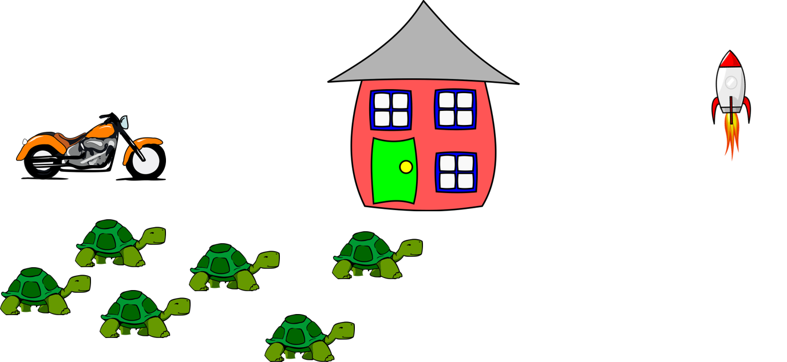
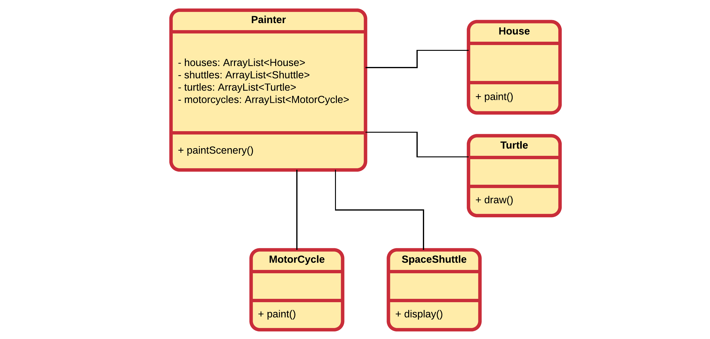

## A Painter without Interfaces

Consider a class `Painter` that tracks a number of objects of different types and paints a scenery with them. The `Painter` class can paint:
* Houses
* SpaceShuttles
* Turtles
* MotorCycles



A beginning programmer might implement this by creating a class `Painter` that holds several `ArrayList` of each type:

```java
public class Painter {
    private ArrayList<House> houses = new ArrayList(); 
    private ArrayList<SpaceShuttle> shuttles = new ArrayList();
    private ArrayList<Turtle> turtles = new ArrayList();
    private ArrayList<MotorCycle> motorcycles = new ArrayList();

    // ....
}
```

The `Painter` class could have a `paintScenery()` method that contains a for-loop for each `ArrayList` contained in the `Painter`. Each for-loop might iterate over each list calling the correct methods to get the objects painted. If these classes are not created by a single developer, it might even be so that a `House` implements a `paint()` method, while a `Turtle` implements a `draw()` method and a `SpaceShuttle` has a `display()` method.

This would effectively make the `paintScenery()` method of `Painter` look something like this:

```java
public void paintScenery() {
    for (House house : houses) {
        house.paint();
    }
    for (SpaceShuttle shuttle : shuttles) {
        shuttle.display();
    }
    for (Turtle turtle : turtles) {
        turtle.draw();
    }
    for (MotorCycle motorcycle : motorcycles) {
        motorcycle.paint();
    }
}
```

There a couple of problems with this approach:
* Currently the `Painter` is **depending on all the classes** `House`, `SpaceShuttle`, `Turtle` and `MotorCycle`. And this is bad design. If any of these classes change their painting method, `Painter` may need to change too.
* The design **does not encourage extension** of the current implementation. If we wished to add another class that needs to be painted, it would require a lot of change in different places to the current application.
* There is **no general rule on how the paint methods should be called** or even which arguments they take. By agreeing upon a standard, the code would become much cleaner.

Below is a UML diagram that clearly shows that `Painter` has associations with `House`, `SpaceShuttle`, `Turtle` and `MotorCycle`. A single class depending on a lot of other classes often indicates a problem.

