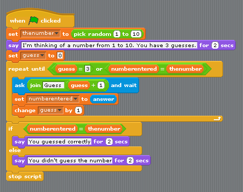

<!-- toc -->

# Introduction to Computer Programming

Today, most people don't need to know how a computer works. Most people can simply turn on a computer or a mobile phone and point at some little graphical object on the display, click a button or swipe a finger or two, and the computer does something. How to interact with a computer program is all the average person needs to know.

Since you are going to learn how to write computer programs, you need to know a little bit about how a computer works. Your job will be try to instruct the computer to do things you want it to do.

Basically, writing software (computer programs) involves describing processes and procedures; it involves the authoring of algorithms.  Computer programming involves developing lists of instructions - the source code representation of software  The stuff that these instructions manipulate are different types of objects, e.g., numbers, words, images, sounds, etc...  Creating a computer program can be like composing music, like designing a house, like creating lots of stuff.  It has been argued that in its current state it is an art, not engineering.

> **proc-ess / Noun:** A series of actions or steps taken to achieve an end.
>
> **pro-ce-dure / Noun:** A series of actions conducted in a certain order.
>
> **al-go-rithm / Noun:** An ordered set of steps to solve a problem.

An important reason to consider learning about how to program a computer is that the concepts underlying this will be valuable to you, regardless of whether or not you go on to make a career out of it.  One thing that you will learn quickly is that a computer is very dumb, but obedient.  It does exactly what you tell it to do, which is not necessarily what you wanted.  Programming will help you learn the importance of clarity of expression.

> It has often been said that a person does not really
> understand something until he teaches it to someone else.
>	Actually a person does not really understand something
>	until after teaching it to a computer, i.e., express it
>	as an algorithm."
>
> *(Donald Knuth, in "American Mathematical Monthly," 81)*

<!-- How to break this? -->

> Computers have proven immensely effective as aids to clear
>	thinking.  Muddled and half-baked ideas have sometimes
>	survived for centuries because luminaries have deluded
>	themselves as much as their followers or because lesser
>	lights, fearing ridicule, couldn't summon up the nerve to
>	admit that they didn't know what the Master was talking
>	about. A test as near foolproof as one could get of whether
>	you understand something as well as you think is to express
>	it as a computer program and then see if the program does
>	what it is supposed to. Computers are not sycophants and
>	won't make enthusiastic noises to ensure their promotion
>	or camouflage what they don't know.  What you get is what
>	you said.
>
> *(James P. Hogan in "Mind Matters")*

But, most of all, it can be lots of fun! You can think of a computer as your own little entity you get to boss around all day to do all kinds of neat stuff for you.

## Let's start programming

> Writing software, computer programs, is a lot like
> writing down the steps it takes to do something.

Before we see what a computer programming language looks like, let's use spoken language such as the English language to describe how to do something as a series of steps.  A common exercise that really gets you thinking about what computer programming can be like is to describe a process you are familiar with.

> #### Assignment::Taking out the dog
>
> Write down the sequential steps to take out the dog to do its business.

While this is certainly a useful exercise you can already feel that programming in a natural language can become very complex and computers are just not ready for it yet. Heck, most humans aren't even ready for it yet.

> So what will be the result? I expect natural language programming will eventually become ubiquitous as a way of telling computers what to do. People will be able to get started in doing programming-like tasks without learning anything about official “programming” and programming languages: they’ll just converse with their computers as they might converse with another person.
>
> *Stephen Wolfram*

### Graphical Programming Languages

A little less than fifteen years ago, Mitchel Resnick and friends at MIT introduced a programming environment called Scratch. It provides a new approach to teaching computer programming through a graphical user interface that eliminates the possibility of making certain mistakes common in text-based programming.

Programs are constructed by connecting blocks, each representing some functionality available in the system.

[^1]: Source: https://growageneration.com/2013/02/18/scratch-programming-and-3rd-grade-common-core/

The image above shows a simple program that generates a random number and gives the user three goes at guessing it. The shapes of the blocks determine where they can be placed to form an acceptable program.

One of Scratch's strengths is the ease with which students can construct games and animated simulations and stories.  Another strength is the Scratch website itself which provides access to many tutorials and a community of users with programs they've written.

Blocks-based programming is a great way to get started. But, as the size of the programs you want to write grows or you need a feature not available in Scratch, it's time to switch to text-based programming.

## Source

This chapter is heavily based on http://guyhaas.com/bfoit/itp/Programming.html which is free of copyrights.
