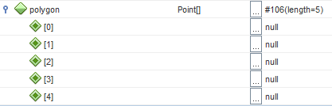

## Arrays

Arrays are **container objects** that store a fixed amount of values of a single type.
The length of the array is specified when the array object is created. After the array is
created its length cannot be changed.

The example code below shows how to declare and create an array of 10 integers:

```java
int[] randomNumbers = new int[10];
```

Notice how square brackets after the element type specify that this is an array.

As **an array is actually an object** so the actual creation needs to be done using the `new` operator, at which stage the length of the array also needs to be specified.

A visualization of the array may look something like this:


Each item in an array is called an element, and each element is accessed by its numerical index. As shown in the preceding visualization, numbering begins with 0 (this is called **zero-indexed**). The 9th element, for example, would therefore be accessed at index 8.

Let's look at some code that generates a random number of each element and then prints the array of integers to the terminal:

```java
final int NUMBER_OF_RANDOMS = 10;

int[] randomNumbers = new int[NUMBER_OF_RANDOMS];
Random randomGenerator = new Random();

// First generate random numbers
for (int i = 0; i < NUMBER_OF_RANDOMS; i++) {
    randomNumbers[i] = randomGenerator.nextInt();
}

// Print out all the values
for (int i = 0; i < NUMBER_OF_RANDOMS; i++) {
    System.out.println("randomNumbers[" + i + "]: " + randomNumbers[i]);
}
```

From the code above can be seen that you can access elements by using `[]` with the index specified between them.

### Arrays of object references

Arrays can actually hold any type of elements (each element should however be of the same type within an array).

This means that we can actually create an array of Points.

```java
final int NUMBER_OF_POINTS = 5;

Point[] polygon = new Point[NUMBER_OF_POINTS];
```

What is special about the array above is that it is an array of references to objects. This also implies that all the references are null at this point. In other words if you create an array of object references, all elements are null until you assign them the actual reference.

> #### Hint::Debug to confirm
>
>  You can actually confirm this by setting a breakpoint in NetBeans on the line where you declare the polygon variable. Then take a look at the _Variables_ window as shown in the image below.
>
> 

To fix this we need to assign an object reference to each element of the array as shown in the next code snippet.

```java
final int NUMBER_OF_POINTS = 5;

Point[] polygon = new Point[NUMBER_OF_POINTS];

for (int i = 0; i < NUMBER_OF_POINTS; i++) {
  polygon[i] = new Point();
}
```

### Summary

Arrays are:

* Fixed-size, meaning that ones their size is set they cannot be resized.
* Single-typed, meaning they can only hold 1 type of data.
* Zero-indexed, meaning that the first element is located at position 0.
* Sequential collections, meaning that the elements are positioned one after another in memory.
* Ordered, meaning that the order of the elements will not change unless you change them.

We can create arrays of primitive and non-primitive types. Non-primitive types are initialized to null and each element needs to be assigned an object reference before using it.
