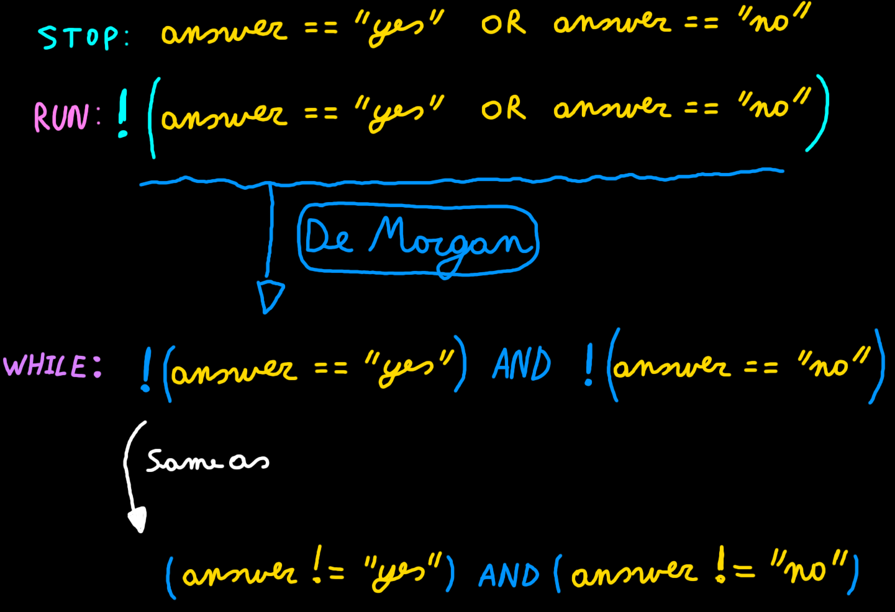

## Control Flow Statements

The statements inside your source files are generally executed from top to bottom, in the order that they appear. Control flow statements, however, break up the flow of execution by employing decision making, looping, and branching, enabling your program to conditionally execute particular blocks of code. This section describes the decision-making statements (if-then, if-then-else, switch), the looping statements (for, while, do-while), and the branching statements (break, continue, return) supported by the Java programming language.

### Making Decisions in Java

To allow our program to make certain decisions we first need to take a look at conditions and how they are evaluated.

A condition is some sort of comparison (or a combination of comparisons) that can be evaluated by the compiler or interpreter. After solving all comparisons and combining all the individual parts, the compiler resolves it to a single resulting value that is `true` or `false` (also keywords in Java), which are actually values the data type `boolean` can take. Generally spoken we state that the compiler evaluates the condition to be true or false.

The true and false values can differ from language to language, however internal in memory false is most of the time 0 and true is not 0.

#### Comparison Operators

The table below shows the available comparison operators that can be used in Java to build a condition.

| Operator | Description |
|---|---|
| == | equal to |
| != | not equal to |
| > | greater than |
| >= | greater than or equal to |
| < | less than |
| <= | less than or equal to |

Since a conditional statement actually produces a single 'true' or 'false' result, this result can actually be assigned to a variable of type `boolean`.

Let's see some examples of conditional statements:

```java
int a = 4;
int b = 8;
boolean result;
result = (a < b);   // true
result = (a > b);   // false
result = (a <= 4);  // a smaller or equal to 4 - true
result = (b >= 9);  // b bigger or equal to 9 - false
result = (a == b);  // a equal to b - false
result = (a != b);  // a is not equal to b - true
```

#### Conditional Operators

When creating more complex conditional statements you will need to use the conditional operators to create combinations of conditions.

The table below gives an overview of the available conditional operators in Java.

| Operator | Description |
|---|---|
| && | AND |
| &#124;&#124; | OR |
| ! | NOT |

> #### Alert::Lazy evaluation
>
>  These operators exhibit "short-circuiting" behavior, which means that the second operand is evaluated only if needed. This is also called lazy evaluations.

These work as you know them from the Boolean algebra. The `||` (OR) operator will return `true` if either of the operands evaluate to `true`. The `&&` (AND) operator will return `true` if both operands evaluate to `true`. A logical expression can be negated by placing the `!` (NOT) operator in front of it.

The code example below checks if a person is a child based on it's `age` (between 0 and 14 years of age).

```java
int age = 16;
boolean isChild = (age >= 0 && age <= 14);      // false
```

> #### Hint::De Morgan's Laws
>
> In some cases it can be useful to rewrite complex conditions using De Morgan's Laws
> (https://en.wikipedia.org/wiki/De_Morgan%27s_laws). Do take note that shorter not always
> implies more readable or less complex.


#### The if statement

The `if` statement is the most basic of all the control flow statements. It tells your program to execute a certain section of code only if a particular condition evaluates to true.

Let's take for example a very simple example where we test if the students score (generated randomly for this example) is below 70% and if so we output an encouraging speech.

```java
Random random = new Random();
int studentScore = random.nextInt(101);
//...
System.out.println("Your score is " + studentScore + "%");
if (studentScore < 70) {
  System.out.println("Come on buddy, you will need to work a little harder.");
  System.out.println("You can do it. Still got some time till the exams.");
}
```

If this test evaluates to false (meaning that the score is equal or above 70), control jumps to the end of the if statement.

#### The if-else Statement

The if-else statement provides a secondary path of execution when an "if" clause evaluates to false. Taking the previous example you could output a "good job" speech when the students score is equal or above 70%.

```java
Random random = new Random();
int studentScore = random.nextInt(101);
//...
System.out.println("Your score is " + studentScore + "%");
if (studentScore < 70) {
  System.out.println("Come on buddy, you will need to work a little harder.");
  System.out.println("You can do it. Still got some time till the exams.");
} else {
  System.out.println("Good job. Keep up the good work.");
}
```

The if-else statement can be extended with even more if-else statements. Each if-else will need a new condition that needs to be checked. The first one that evaluates to true is executed, after which control jumps to the end of the if-else statements.

Let's extend our grading example to be a bit more student friendly:

```java
Random random = new Random();
int studentScore = random.nextInt(101);
//...
System.out.println("Your score is " + studentScore + "%");
if (studentScore >= 90) {
  System.out.println("Omg, good job. Keep up the work.");
} else if (studentScore >= 70) {
  System.out.println("Some room for improvement but you are on your way.");
} else if (studentScore >= 50) {
  System.out.println("Ok. But you may want to considering studying a bit more.");
} else if (studentScore >= 30) {
  System.out.println("Come on buddy, you will need to work a little harder.");
} else {
  System.out.println("You may want to cancel your holiday vacation for studying.");
}
```

You may have noticed that the value of `studentScore` can satisfy more than one expression in the compound statement. However the conditions are checked sequentially and once a condition is satisfied, the appropriate statements are executed and the remaining conditions are not evaluated.

## Loop statements

There may be a situation when you need to execute a block of code several number of times. In general, statements are executed sequentially: The first statement in a block is executed first, followed by the second, and so on. Programming languages provide various control structures that allow for more complicated execution paths.

Java programming language provides the following types of loops to handle looping requirements:

* **for loop**: Execute a code block multiple times and simplify the code that manages the loop variable.
* **while loop**: Repeats a code block while a given condition is true. It tests the condition before executing the body of the loop.
* **do-while loop**: Like a while statement, except that it tests the condition at the end of the loop body.

### The for loop

Basically a for loop is most often used when the number of iterations is pre-determined. A typical example would be a list of items where an actions needs to be applied to each item in the list.

The for loop adheres to the following construction template:

```java
for (initialization ; condition ; increment) {
  // Code block
}
```

* The **initialization** statement is executed only once before the loop mechanism is started.
* The **condition** is checked before each iteration and will determine if the code block is executed or not
* The **increment** expression is invoked after each iteration through the loop. Most often this expression is used to increment or decrement a condition variable.

Each of these can be left empty. For example an endless loop can be written as:

```java
for (;;) {
  /// Do something forever
}
```

Let's see the most simple example possible. A simple for loop that outputs the text `"Hello"` 10 times to the terminal.

```java
for (int i = 0; i < 10; i++) {
  System.out.print("Hello ");
}
```

In the example above the initialization step is used to create a local variable `i` which serves as a simple counter. Next the condition is checked and the text is outputted to the terminal. Next `i` is incremented (1 is added). Before the next iteration the value of `i` is checked in the condition and the loop continues.

The last iteration happens when `i` was incremented to 9. The loop is executed a last time and the value of `i` is incremented a last time to 10. Next the condition is checked but not met. The loop is terminated and execution jumps after the for loop.

Want to see the values of i? Use the following code:

```java
for (int i = 0; i < 10; i++) {
  System.out.println(i + ": Hello");
}
```

This outputs:

```
0: Hello
1: Hello
2: Hello
3: Hello
4: Hello
5: Hello
6: Hello
7: Hello
8: Hello
9: Hello
```

Important to note is that the variable `i` used here has local scope. This means that it only exists in the for-loop. If you wish to know the last value of `i` you can create a variable before the for-loop and skip the initialization step in the for-loop header. The code below shows an example of this. Do note that you still need to add a semicolon in the for-loop header to separate the initialization from the condition part.

```java
int i = 0;
System.out.println("i = " + i + " before for loop");
for (; i < 10; i++) {
  System.out.println(i + ": Hello");
}
System.out.println("i = " + i + " after for loop");
```

This outputs:

```
i = 0 before for loop
0: Hello
1: Hello
2: Hello
3: Hello
4: Hello
5: Hello
6: Hello
7: Hello
8: Hello
9: Hello
i = 10 after for loop
```

### The while loop

The while loop is used when the code block may not even run at all if the condition is not met. The condition is checked before the code block is executed.

While every while loop can also be written as a for loop that does not mean it should. Complex for loops can often be refactored into less complex while or do-while loops.

The while loop adheres to the following construction template:

```java
while (condition) {
  // Code block
}
```

The code below prints out a list of random numbers that are dividable by a certain number. In this case it prints 10 numbers that are dividable by 5.

```java

final int DIVIDER = 5;
final int NUMBERS_TO_FIND = 10;
final int MAX_NUMBER = 10000;

Random randomizer = new Random();

int numbersFound = 0;
while (numbersFound <= NUMBERS_TO_FIND) {
  int currentNumber = randomizer.nextInt(MAX_NUMBER);

  if (currentNumber % DIVIDER == 0) {
    System.out.println(currentNumber + " is dividable by " + DIVIDER);
    numbersFound++;
  }
}

```

### The do-while loop

A do-while loop is used when the code block needs to be executed at least once. After the first iteration a condition is checked which determines if the code block should be executed again or not.

The do-while loop adheres to the following construction template:

```java
do {
  // Code block
} while (condition);
```

Take note that after the closing round bracket a semicolon is required.

The next code examples asks the user to answer 'yes' or 'no' to a question. It keeps asking the user the question until it get's a valid answer.

```java
Scanner console = new Scanner(System.in);

String answer = "";
do {
    System.out.print("Would you like to learn Java ? [yes,no]: ");
    answer = console.nextLine();
} while (!answer.equalsIgnoreCase("yes") && !answer.equalsIgnoreCase("no"));
```

The condition in the while statement above may seem contradictory at the beginning. If you need to model more complex conditions it is sometimes necessary to build them step by step.

The following diagram shows a step by step method for building the condition above.



1. First determine the condition necessart to stop the while loop. In this case that is when the user answers either "yes" or "no".
2. Next invert the whole condition to use it with a while loop. This is actually the necessary condition to keep the while loop running.
3. Next you can simplify the condition by using De Morgan's laws

Note that Strings are actually objects and we cannot use the simple comparison operator `==`. This would actually compare the references and not the content of the objects. More on this later.
