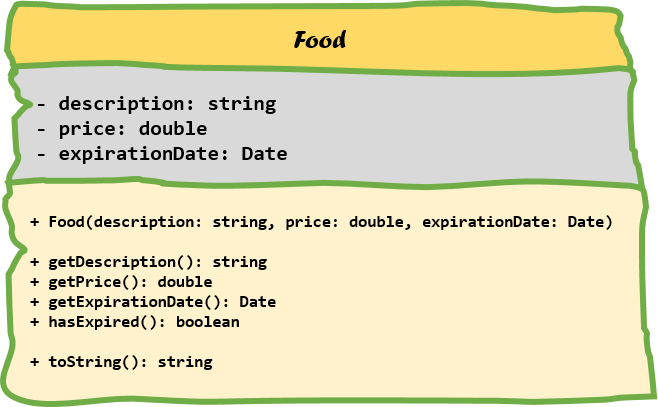

## Inheritance

Inheritance is one of the main pillars of an object-oriented programming language. It allows us to reuse classes, make our code cleaner and more hierarchical.

### A store application example

Let's image we have to build an application to track all the goods that are sold in a specific store. The store owner asked us to create a simple application in Java. Since he only started a few weeks ago his supply of goods is very limited. He currently only sells some food products and some basic clothing.

To start of we create a *Clothing* class and a *Food* class. The UML diagrams of both classes are depicted below.


For the *Clothing* class we define the properties to be a description, a price and a size. The type of size is set to `string` to be able to contain sizes like "XL" and "M".



The *Food* class is similar as it also has the properties description and price. On top of those it also has an expiration date of type `Date` (more info on this class can be found at [https://docs.oracle.com/javase/8/docs/api/java/util/Date.html](https://docs.oracle.com/javase/8/docs/api/java/util/Date.html)). Note that it also contain a method `hasExpired()` which returns true if the expiration date is greater than or equal to todays date.

Both classes contain constructors, some getters and a `toString()` method that returns a full description of the product (containing description, price and depending on the class the size or the expiration date).

#### Code always changes

Something to remember is that code evolves. It changes over time as things get added, removed or refactored. Static code will eventually become outdated and die.

So let's take the store example from the previous section as an example. You created the *Clothing* and *Food* class after which your boss shows up and tells you to add a product identifier to all the goods. This means you need to change both classes as shown in the following UML class diagrams.


Note that the product id is not added as an argument to the constructor of the class but instead set using a setter method `setProductId()`. This because of the assumption that most of the time the product id will be generated based on the ones that are already taken (product are most likely to be stored in a database).


Notice that we had to change two classes to add a product id attribute, a getter and a setter. We actually also need to change the implementation of the constructor to generate an id based on the ones already taken. And if we are not careful we might forget to change the `toString()` implementation.

It should feel awkward to change two classes for a single change based on a single property. And what if we had like 10, 20 or a 100 sorts of goods. It would be a days work to add such a simple thing to our application.

Let's be lazier but smarter programmers and take another approach to this problem.

### Back to inheritance

The extension of the classes with a product id can be easily solved (literally minutes, even with 100 different types of products) if we had some sort of general product class that held all the common properties and actions of all the products our client sells. This is exactly what inheritance provides for us.

Inheritance allows a class to inherit (get) the properties and methods of another class. In other words, the **subclass** inherits the states and behaviors from the **base class**. The subclass is also called the **derived class** while the base class is also known as the **super-class**. The derived class can add its own additional variables and methods. These additional variable and methods differentiates the derived class from the base class.

A super-class can have any number of subclasses. But a subclass can have only one superclass. This is because Java does not support *multiple inheritance*.

So going back to our example we could create a `Product` class and put all the common properties of `Clothing` and `Food` in this class. The same can be done for the methods of the `Clothing` and `Food` class. Do take note that the constructor of the `Product` class can only be used to create a general `Product` object and does not know of the `Food` and `Clothing` classes and their more specific properties such as expiration date and size.


Also notice how we changed the name of the `productId` attribute to `id`. As it is part of the `Product` class it is not necessary to call it `productId`.

We also provided an implementation for the `toString()` method.

Now our derived class `Clothing` can be refactored to a very simple class with only the specific size attribute, a constructor, a getter and a more specific implementation of `toString()`.


Note how we do need to add the necessary arguments of the base class to the constructor in order to make an object of `Clothing`. So to create a piece of clothing we do need to provide it's description, price and size. Description and price are part of the base class `Product` but are inherited by the `Clothing` class.

A similar refactor needs to be done to the `Food` class.


In an UML class diagram inheritance is depicted by drawing a closed arrow from the subclass to the base class as shown in the diagram below.


### Is-a relationships

The superclass and subclass have an **"is-a"** relationship between them. This means we can state that `Food` is-a `Product` and `Clothing` is-a `Product` if we take the previous example.

If you cannot logically state that 'subclass' is-a 'superclass' than you made a mistake to make 'subclass' inherit from 'superclass'. An example of this would be the case when you would create a subclass `Cement` from `Food` because `Cement` also has an expiration date. This may seem DRY but it is illogical. You can't state that `Cement` is-a `Food`.

Let's see some examples:

If we needed to model both a *Bus* class and a *Car* class it makes perfect sense to create a *Vehicle* class and make both *Bus* and *Car* inherit from them. It's perfectly valid to state that
* a Bus is a Vehicle
* a Car is a Vehicle

### Inheritance in Java

To implement inheritance in Java all you need is a baseclass and a subclass. The subclass needs to extend the baseclass and this can be accomplished by using the `extends` keyword as shown below in the code template.

```java
public class <subclass> extends <baseclass> {
  // Implementation
}
```

Note that *extending* the baseclass is exactly what we are doing when implementing inheritance. We take a general class and add something to it: data, behavior or both.

#### Constructors and inheritance

When creating objects, Java will not only call the constructor of the type you are creating but it will implicitly call a constructor of each baseclass. Let's take a look at the inheritance hierarchy below.


When for example creating an object of type *QuadCore*, the constructor of *QuadCode* will implicitly call the constructor of *Processor* which will call the constructor of *ComputerHardware* which will call the constructor of *Product*. These calls are provided by default by Java and are done before anything else. That means that the rest of you constructor code will be executed ofter the contructor call to the baseclass.

 This basically means that the *Product* will be constructed first, next the *ComputerHardware*, after which the *Processor* and last the *QuadCore*. This is a bit logical as you can only initialize the specific data of *ComputerHardware* after the data of *Product* has been initialized.

There is however a catch to this whole constructing system.

Remember that if you do not define a constructor in Java, it will provide you with a *default constructor* for a class. However once you create a constructor yourself
Java will not provide this default constructor anymore. That means if you create a single constructor that takes arguments, your class will not have a default constructor anymore.

Let's take a look at a simplified `Product` class:

```java
public class Product {

    private String description;
    private double price;

    public Product(String description, double price) {

        // Initialization
    }
}
```

The implementation above defines a single constructor taking a *description* and a *price*. This means that we can only construct objects using that constructor an **NOT** as follows:

```java
// This fails because Product has no default constructor !!
Product tootPaste = new Product();
```

Now take a subclass `Clothing` of *Product* as defined below. As can be seen a single constructor is provided.

```java
public class Clothing extends Product {
    private String size;

    public Clothing(String description, double price, String size) {

        // Your code
    }
}
```

This code will actually not work because Java will add an implicit call to the default constructor of Product as the first line of code in the `Clothing` class.
In other words if no default constructor exists for the baseclass your program will fail.

This can be fixed using two approaches:
* add a default constructor to the baseclass. This is however not always possible or even advisable as you may not have access to the implementation of the baseclass or it might not make sence to add a default constructor.
* explicitly call another constructor of the baseclass. This can be achieved by using the keyword `super` which can be called as a method `super()` to indicate that a baseclass constructor needs to be called first.

The second approach mostly takes the preference. Important to note here is that this call to the baseclass constructor has to happen **before anything** else in the constructor. This means that `super()` will be the first line of code inside your constructor in this case.

Let us apply this knowledge to the `Product` and `Clothing` classes.

```java
public class Product {

    private String description;
    private double price;

    public Product(String description, double price) {
      this.description = description;
      this.price = price;
    }
}
```

```java
public class Clothing extends Product {
    private String size;

    public Clothing(String description, double price, String size) {
      super(description, price);    // Call baseclass constructor FIRST !!!!

      // Rest of initialization for Clothing
      this.size = size;
    }
}
```

##### Quick summary

* Java provides a default constructor if you provide no constructor(s).
* With inheritance each constructor is called from bottom to top but actually executed from top to bottom.
* If no default constructor exists for the baseclass you will need to add one or call another constructor explicitly as first line of code in the current class constructor using  `super()` and provide the required arguments.


#### Applied to store application

Applying all the principles mentioned in the previous section we come to the following implementation in Java.

```java
public class Product {
    // Normally product would be saved in database and the ID would
    // be retrieved from the database however to simulate automatic id
    // generation we keep a private static lastId
    private static int lastId = 0;

    private int id;
    private String description;
    private double price;

    public Product(String description, double price) {
        this.description = description;
        this.price = price;
        setId(lastId++);
    }

    public String getDescription() {
        return description;
    }

    public double getPrice() {
        return price;
    }

    public void setId(int id) {
        this.id = id;
    }

    @Override
    public String toString() {
        return "Product: { id: " + id + ", price: " + price + "}"
                    + "\n" + "[" + description + "]";
    }
}
```

```java
public class Clothing extends Product {
    private String size;

    public Clothing(String description, double price, String size) {
        super(description, price);    // Call baseclass constructor FIRST !!!!

        // Rest of initialization for Clothing
        this.size = size;
    }

    public String getSize() {
        return size;
    }

    @Override
    public String toString() {
        String result = super.toString();
        return result + "\nClothing: {size: " + size + "}";
    }
}
```

```java
public class Food extends Product {
    private Date expirationDate;

    public Food(String description, double price, Date expirationDate) {
        super(description, price);    // Call baseclass constructor FIRST !!!!

        // Rest of initialization for Food
        this.expirationDate = expirationDate;
    }

    public Date getExpirationDate() {
        return expirationDate;
    }

    @Override
    public String toString() {
        String result = super.toString();
        return result + "\nFood: {Expires: " + expirationDate + "}";
    }
}
```

With a small main program:

```java
public static void main(String[] args) throws ParseException {
    // Some date helper object
    DateFormat dateFormat = new SimpleDateFormat("dd/MM/yyyy", Locale.ENGLISH);

    // Creating a Food object
    Food canOfTomatoSoup = new Food("Can of tomato soup with meat balls",
            2.99, dateFormat.parse("21/12/2018"));

    // Creating a piece of clothing
    Clothing socks = new Clothing("Pair of black socks for men", 3.45, "XL");

    // You can actually store the reference to a
    // Food or Clothing object inside a Product reference
    Product metallicaShirt = new Clothing("Cool t-shirt of Metallica", 18.99, "L");

    // Lets print everything
    System.out.println(canOfTomatoSoup + "\n");
    System.out.println(socks + "\n");
    System.out.println(metallicaShirt + "\n");
}
```

#### Method overriding

Method overriding, in object oriented programming, is a language feature that allows a subclass or child class to provide a specific implementation of a method that is already provided by one of its superclasses or parent classes. The implementation in the subclass overrides (replaces) the implementation in the superclass by providing a method that has same name and same parameters (signature), and same return type as the method in the parent class. An overriding method can also return a subtype of the type returned by the overridden method. This subtype is called a covariant return type.

> #### Alert:: Method overriding <=> Method overloading
> Method Overloading is a feature that allows a class to have two or more methods having same name, if their argument lists are different. Constructor overloading allows a class to have more than one constructors having different argument lists. Overloaded methods are differentiated by the number and the type of the arguments passed into the method.
>

The version of a method that is executed will be determined by the object that is used to invoke it. If an object of a parent class is used to invoke the method, then the version in the parent class will be executed, but if an object of the subclass is used to invoke the method, then the version in the child class will be executed.

The ability of a subclass to override a method allows a class to inherit from a superclass whose behavior is "close enough" and then to modify behavior as needed.

The UML diagram below shows a couple of examples of method overriding. First of all there is the `draw()` method that is defined the *Shape* class and its descendants. It takes no arguments and has no return value. Next there are the `getArea()` and `getCircumference()` methods which do return a `double`. Last is the `doesContain()` method which checks if the *Shape* contains a *Point*. It takes an argument and returns a value. Important to note is that the *signature* of all these methods are the same! The rules for method overriding are less strict than that but more on this later.


When overriding a method in Java, you might want to use the `@Override` annotation that instructs the compiler that you intend to override a method in the superclass. If, for some reason, the compiler detects that the method does not exist in one of the superclasses, then it will generate an error.

Some rules:

* The argument list should be exactly the same as that of the overridden method.
* The return type should be the same or a subtype of the return type declared in the original overridden method in the super class.
* The access level cannot be more restrictive than the overridden method’s access level. For example: if the super class method is declared public then the overriding method in the sub class cannot be either private or protected.
* Instance methods can be overridden only if they are inherited by the subclass.
* A method declared final cannot be overridden.
* A method declared static cannot be overridden but can be re-declared.
* If a method cannot be inherited then it cannot be overridden.
* A subclass within the same package as the instance’s superclass can override any superclass method that is not declared private or final.
* A subclass in a different package can only override the non-final methods declared public or protected.
* An overriding method can throw any uncheck exceptions, regardless of whether the overridden method throws exceptions or not. However the overriding method should not throw checked exceptions that are new or broader than the ones declared by the overridden method. The overriding method can throw narrower or fewer exceptions than the overridden method.
* Constructors cannot be overridden.

You can call methods of the base class by using the `super` keyword followed by a `.` and the name of the method you wish to call. This can be useful if you do not want to replace the implementation of the baseclass but rather want to extend it.

Example:

```java
String result = super.toString();
```

#### Polymorphism

This comes from Greek and means:
* Poly = many
* Morph = form, shape

So polymorphism is the ability of an object to take on many forms. The most common use of polymorphism in OOP occurs when a parent class reference is used to refer to a child class object.

This basically means that you can do the following in our `Product` example application:

```java
Product canOfTomatoSoup = new Food("Can of tomato soup with meat balls",
        2.99, dateFormat.parse("21/12/2018"));

Product socks = new Clothing("Pair of black socks for men", 3.45, "XL");
Product metallicaShirt = new Clothing("Cool t-shirt of Metallica", 18.99, "L");
```

This is often used when storing subtypes inside and array or container class:

```java

Product listOfProduct[] = new Product[10];

listOfProduct[0] = new Food("Can of tomato soup with meat balls",
        2.99, dateFormat.parse("21/12/2018"));

listOfProduct[1] = new Clothing("Pair of black socks for men", 3.45, "XL");
listOfProduct[2] = new Clothing("Cool t-shirt of Metallica", 18.99, "L");
```

Of course in a realistic application we would populate the list from a database or a file.

Java tracks the actually type of object. This basically means that while all the objects created above
are Products because of inheritance, Java still knows that some are Clothing or Food.

Lets take a look at another example. Take a class `Animal` and two subclasses `Cat` and `Dog`.
We implement a `talk()` method for each of these as shown below.

```java
class Animal {
    public String talk() {
        return "Grrrrr!";
    }
}

class Cat extends Animal {
    @Override
    public String talk() {
        return "Meow!";
    }
}

class Dog extends Animal {
    @Override
    public String talk() {
        return "Woof!";
    }
}
```

Now note that polymorphism allows us to create a single method `lets_hear_it()` that
takes an argument of type `Animal`. When we call it on either type of Animal or subclasses
the correct implementation will automatically be called by Java.

```java
public class AnimalApp {
    public static void lets_hear_it(Animal animal) {
        System.out.println(animal.talk());
    }

    public static void main(String[] args) {
        lets_hear_it(new Cat());            // Meow!
        lets_hear_it(new Dog());            // Woof!
        lets_hear_it(new Animal());         // Grrrrr!
    }
}
```

If we did not have this polymorphic behavior we would have to create a `lets_hear_it()`
method for each type of Animal. This would definitely cause lots of errors and headaches.

So polymorphism is again another technique that allows us to write short, clean and maintainable code.

#### What is accessible from the baseclass

Attributes and methods are declared with an **access specifier** such as `private`, `protected` or `public`. These allow the developer to determine who can access the class, attributes or methods.

When inheriting from a baseclass it is important to understand that you cannot access the private attributes or methods of the baseclass inside your subclass.

Let's take a look at our product store example.


In the Product class we declared `id`, `description` and `price` to be private (as it should), but that also means that the `Clothing` and `Food` classes cannot access these attributes, even while they did inherit them. However this is not a problem as we did provide getter methods which are public. This means that `Clothing` and `Food` can get the values of these attributes, but they cannot change them.

Now what if we wanted to keep the protection of `private` but allow our subclasses access to some attributes of methods. In this case we can make use of the `protected` keywords. We could for example state that `id` cannot be changed after construction, but `price` and `description` can. In this case we could make `price` and `description` protected.

Let's take another example: consider a class `SpaceObject` with a subclass `Planet`. Than we also create a class `Space` which is composed of several `SpaceObject`s and `Planet`s. As shown below, protected attributes and methods are noted using the `#` symbol in UML.


In the example the `size` of a SpaceObject can only be accessed by SpaceObject itself, not even by the subclass Planet. However the `coordinates` are accessible by both SpaceObject and all of its subclasses (such as Planet). However not accessible from outside. `MAX_SIZE` is a `final` and `static` class variable which is made `public` and so accessible by all. However as it is `final` it can only be read and not written.

Let's make an overview

| Attribute of SpaceObject | Accessible by Planet? | Accessible by Space? |
|----|----|----|
|size|NO|NO|
|coordinates|YES|NO|
|MAX_SIZE|YES|YES|

The same rules apply for access specifiers of methods.

### When not to use inheritance

When implementing inheritance you should always make sure that it makes sense to inherit. Let's take a look at a bad example of inheritance. Take for a example a class `Vector`. You can find what a `Vector` is @ oracle [https://docs.oracle.com/javase/8/docs/api/java/util/Vector.html](https://docs.oracle.com/javase/8/docs/api/java/util/Vector.html).

> The Vector class implements a growable array of objects. Like an array, it contains components that can be accessed using an integer index. However, the size of a Vector can grow or shrink as needed to accommodate adding and removing items after the Vector has been created.

It has for example the methods `add(int index, E element)` to insert an element at a given index and `elementAt(int index)` to retrieve an element at a given index.

Now if we take a look at the class `Stack` found @ oracle [https://docs.oracle.com/javase/8/docs/api/java/util/Stack.html](https://docs.oracle.com/javase/8/docs/api/java/util/Stack.html)

> The Stack class represents a last-in-first-out (LIFO) stack of objects. It extends class Vector with five operations that allow a vector to be treated as a stack. The usual push and pop operations are provided, as well as a method to peek at the top item on the stack, a method to test for whether the stack is empty, and a method to search the stack for an item and discover how far it is from the top.

The fundamental flaw here is that the `Stack` class also inherits the *public interface* of the `Vector` class meaning you can write the following in Java:

```java
Stack messages = new Stack();

messages.push("Hello");
messages.push("World");
messages.add(1, "Should be at the top");
```

Making your stack look like this:

```text
Hello
Should be at the top
World
```

The `add(int index, E element)` should not be part of the `Stack` public interface, meaning `Stack` should not have been inherited from `Vector`. Stack should only have the `push()` and `pop()` methods.

Than how would you solve this problem ? Simple, using **composition**. We create a class `Stack` and give it an attribute if type `Vector`. This way we have the same functionality but we can hide the public interface of the *Vector* class (remember data hiding from the introduction chapter).

Let's take a look at a really basic implementation of our `Stack` class using composition instead of inheritance

```java
public class Stack {
    private Vector vector;

    // Default constructor
    public Stack() {
        vector = new Vector();
    }

    public void push(int value) {
        vector.add(value);
    }

    public int pop() {
        // This is actually not a good solution to check.
        // Good solution would be to throw exception but that is a subject for
        // later
        if (vector.size() > 0) {
            return (int)(vector.remove(vector.size()-1));
        } else {
            return 0;
        }
    }

    @Override
    public String toString() {
        String output = "";
        for(int i = 0; i < vector.size(); i++) {
            output += "[" + i + "]: " + (int)(vector.elementAt(i)) + "\n";
        }

        return output;
    }
}
```

Now the public interface of our *Stack* class consists of a constructor, the `push()` and `pop()` methods and a `toString()` method.

### Abstract classes

Abstract classes are classes that cannot be instantiated. In other words you cannot construct objects from it.

A common use of abstract classes is to provide an outline of a class. It can already provide functionality, i.e. some parts of the class are implemented and some parts are just outlined with a method declaration.

While an abstract class cannot be instantiated, you can create a concrete class based on an abstract class (through inheritance), which then can be instantiated. To do so you have to inherit from the abstract class and override the abstract methods, i.e. implement them.

An abstract class does a few things for the inheriting subclass:
* Define methods which can be used by the inheriting subclass.
* Define abstract methods which the inheriting subclass must implement.
* Provide a common interface which allows the subclass to be interchanged with all other subclasses.

A class is mostly made abstract because it contains some abstract methods. An abstract method is a method that is declared without an implementation (without braces, and followed by a semicolon), like this:

```java
abstract void draw();
```

If a class includes abstract methods, then the class itself must be declared abstract, as in:

```java
public abstract class Shape {
  // Notice how we can already add attributes and methods
  private Point origin;

  public Shape(Point origin) {
    this.origin = origin;
  }

   // Declare an abstract draw method
   // (we don't know how to draw this yet => subclass should know)
   abstract void draw();
}
```

When an abstract class is subclassed, the subclass usually provides implementations for all of the abstract methods in its parent class.
However, if it does not, then the subclass must also be declared abstract.

A class can also be made abstract to force the user of the class to create a subclass from the base class and not allow him/her to directly instantiate objects from the base class. This might also be useful if you wanted to add abstract methods in the future.
