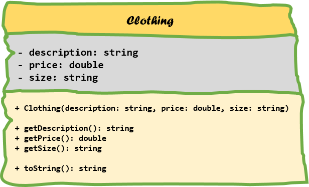
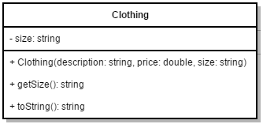

## Inheritance

Inheritance is one of the main pillars of an object-oriented programming language. It allows us to reuse classes, make our code cleaner and more hierarchical.

### An store application example

Let's image we have to build an application to track all the goods that are sold in a specific store. The store owner asked us to create a simple application in Java. Since he only started a few weeks ago his supply of goods is very limited. He currently only sells some food products and some basic clothing.

To start of we create a *Clothing* class and a *Food* class. The UML diagrams of both classes are depicted below.



For the *Clothing* class we define the properties to be a description, a price and a size. The type of size is set to `string` to be able to contain sizes like "XL" and "M".


The *Food* class is similar as it also has the properties description and price. On top of those it also has an expiration date of type `Date` (more info on this class can be found at [https://docs.oracle.com/javase/8/docs/api/java/util/Date.html](https://docs.oracle.com/javase/8/docs/api/java/util/Date.html)). Note that it also contain a method `hasExpired()` which returns true if the expiration date is greater than or equal to todays date.

Both classes contain constructors, some getters and a `toString()` method that returns a full description of the product (containing description, price and depending on the class the size or the expiration date).

#### Code always changes

Something to remember is that code evolves. It changes over time as things get added, removed or refactored. Static code will eventually become outdated and die.

So let's take the store example from the previous section as an example. You created the *Clothing* and *Food* class after which your boss shows up and tells you to add a product identifier to all the goods. This means you need to change both classes as shown in the following UML class diagrams.


Note that the product id is not added as an argument to the constructor of the class but instead set using a setter method `setProductId()`. This because of the assumption that most of the time the product id will be generated based on the ones that are already taken (product are most likely to be stored in a database).


Notice that we had to change two classes to add a product id attribute, a getter and a setter. We actually also need to change the implementation of the constructor to generate an id based on the ones already taken. And if we are not careful we might forget to change the `toString()` implementation.

It should feel awkward to change two classes for a single change based on a single property. And what if we had like 10, 20 or a 100 sorts of goods. It would be a days work to add such a simple thing to our application.

Let's be lazier but smarter programmers and take another approach to this problem.

### Back to inheritance

The extension of the classes with a product id can be easily solved (literally minutes, even with 100 different types of products) if we had some sort of general product class that held all the common properties and actions of all the products our client sells. This is exactly what inheritance provides for us.

Inheritance allows a class to inherit (get) the properties and methods of another class. In other words, the **subclass** inherits the states and behaviors from the **base class**. The subclass is also called the **derived class** while the base class is also known as the **super-class**. The derived class can add its own additional variables and methods. These additional variable and methods differentiates the derived class from the base class.

A super-class can have any number of subclasses. But a subclass can have only one superclass. This is because Java does not support *multiple inheritance*.

So going back to our example we could create a `Product` class and put all the common properties of `Clothing` and `Food` in this class. The same can be done for the methods of the `Clothing` and `Food` class. Do take note that the constructor of the `Product` class can only be used to create a general `Product` object and does not know of the `Food` and `Clothing` classes and their more specific properties such as expiration date and size.


Also notice how we changed the name of the `productId` attribute to `id`. As it is part of the `Product` class it is not necessary to call it `productId`.

We also provided an implementation for the `toString()` method.

Now our derived class `Clothing` can be refactored to a very simple class with only the specific size attribute, a constructor, a getter and a more specific implementation of `toString()`.



Note how we do need to add the necessary arguments of the base class to the constructor in order to make an object of `Clothing`. So to create a piece of clothing we do need to provide it's description, price and size. Description and price are part of the base class `Product` but are inherited by the `Clothing` class.

A similar refactor needs to be done to the `Food` class.


In an UML class diagram inheritance is depicted by drawing a closed arrow from the subclass to the base class as shown in the diagram below.


### Is-a relationships

The superclass and subclass have an **"is-a"** relationship between them. This means we can state that `Food` is-a `Product` and `Clothing` is-a `Product` if we take the previous example.

If you cannot logically state that 'subclass' is-a 'superclass' than you made a mistake to make 'subclass' inherit from 'superclass'. An example of this would be the case when you would create a subclass `Cement` from `Food` because `Cement` also has an expiration date. This may seem DRY but it is illogical. You can't state that `Cement` is-a `Food`.

Let's see some examples:

If we needed to model both a *Bus* class and a *Car* class it makes perfect sense to create a *Vehicle* class and make both *Bus* and *Car* inherit from them. It's perfectly valid to state that
* a Bus is a Vehicle
* a Car is a Vehicle

When implementing inheritance you should always make sure that it makes sense to inherit. Let's take a look at a bad example of inheritance. Take for a example a class `Vector`. You can find what a `Vector` is @ oracle [https://docs.oracle.com/javase/8/docs/api/java/util/Vector.html](https://docs.oracle.com/javase/8/docs/api/java/util/Vector.html).

> The Vector class implements a growable array of objects. Like an array, it contains components that can be accessed using an integer index. However, the size of a Vector can grow or shrink as needed to accommodate adding and removing items after the Vector has been created.

It has for example the methods `add(int index, E element)` to insert an element at a given index and `elementAt(int index)` to retrieve an element at a given index.

Now if we take a look at the class `Stack` found @ oracle [https://docs.oracle.com/javase/8/docs/api/java/util/Stack.html](https://docs.oracle.com/javase/8/docs/api/java/util/Stack.html)

> The Stack class represents a last-in-first-out (LIFO) stack of objects. It extends class Vector with five operations that allow a vector to be treated as a stack. The usual push and pop operations are provided, as well as a method to peek at the top item on the stack, a method to test for whether the stack is empty, and a method to search the stack for an item and discover how far it is from the top.

The fundamental flaw here is that the `Stack` class also inherits the *public* methods of the `Vector` class meaning you can write the following in Java:

```java
Stack messages = new Stack();

messages.push("Hello");
messages.push("World");
messages.add(1, "Should be at the top");
```

Making your stack look like this:

```text
Hello
Should be at the top
World
```

The `add(int index, E element)` should not be part of the `Stack` public interface, meaning `Stack` should not have been inherited from `Vector`.

### Inheritance in Java

To implement inheritance in Java all you need is a baseclass and a subclass. The subclass needs to extend the baseclass and this can be accomplished by using the `extends` keyword as shown below in the code template.

```java
public class <subclass> extends <baseclass> {
  // Implementation
}
```


#### Applied to store application

Applying all the principles mentioned in the previous section we come to the following implementation in Java.

```java
public class Product {
    // Normally product would be saved in database and the ID would
    // be retrieved from the database however to simulate automatic id
    // generation we keep a private static lastId
    private static int lastId = 0;

    private int id;
    private String description;
    private double price;

    public Product(String description, double price) {
        this.description = description;
        this.price = price;
        setId(lastId++);
    }

    public String getDescription() {
        return description;
    }

    public double getPrice() {
        return price;
    }

    public void setId(int id) {
        this.id = id;
    }

    @Override
    public String toString() {
        return "Product: { id: " + id + ", price: " + price + "}"
                    + "\n" + "[" + description + "]";
    }
}
```

```java
public class Clothing extends Product {
    private String size;

    public Clothing(String description, double price, String size) {
        super(description, price);
        this.size = size;
    }

    public String getSize() {
        return size;
    }

    @Override
    public String toString() {
        String result = super.toString();
        return result + "\nClothing: {size: " + size + "}";
    }
}
```

```java
public class Food extends Product {
    private Date expirationDate;

    public Food(String description, double price, Date expirationDate) {
        super(description, price);
        this.expirationDate = expirationDate;
    }

    public Date getExpirationDate() {
        return expirationDate;
    }

    @Override
    public String toString() {
        String result = super.toString();
        return result + "\nFood: {Expires: " + expirationDate + "}";
    }
}
```

With a small main program:

```java
public static void main(String[] args) throws ParseException {
    // Some date helper object
    DateFormat dateFormat = new SimpleDateFormat("dd/MM/yyyy", Locale.ENGLISH);

    // Creating a Food object
    Food canOfTomatoSoup = new Food("Can of tomato soup with meat balls",
            2.99, dateFormat.parse("21/12/2018"));

    // Creating a piece of clothing
    Clothing socks = new Clothing("Pair of black socks for men", 3.45, "XL");

    // You can actually store the reference to a
    // Food or Clothing object inside a Product reference
    Product metallicaShirt = new Clothing("Cool t-shirt of Metallica", 18.99, "L");

    // Lets print everything
    System.out.println(canOfTomatoSoup + "\n");
    System.out.println(socks + "\n");
    System.out.println(metallicaShirt + "\n");
}
```


<!-- TODO:

* Calling constructor of base class using super()
* Calling another method of base class super.method()
* Method overriding
* Cannot access private attributes or methods


alert
super() and the no-argument constructor
If super() is not specified in a subclass constructor, and if the superclass doesn't declare a no-argument constructor, then the compiler will report an error. This is because the subclass constructor must call a no-argument superclass constructor when super() isn't present. -->
