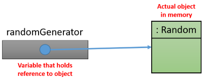
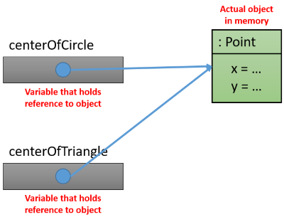

## Variables in Java

The programs that we create need to store all sorts of data. From simple things such as
integers, floating point numbers, characters and Strings to complex data types that we
define ourselves.

This data is stored, manipulated and outputted through our program. The data itself
is stored inside the memory of the computer or system the program is running on.

### Declaring a variable

To allow for easy access inside our programs source code, the variables have a symbolic name
that can be used from within the source code.

In Java, each variable has a specific type, which determines the size and layout of the variable's memory; the range of values that can be stored within that memory; and the set of operations that can be applied to the variable.

> #### Hint::Declare a variable before using it
>
>  You must declare a variable before it can be used.

In Java you need to specify the **type** of the variables followed by a **chosen name**. Optionally you can immediately initialize the variable by assigning a value to it.

Examples of variable declaration with and without initialization:

```java
int age;
int numberOfStudents = 55;    // Initialize to 55
char startOfAlfabet = 'a';    // Initialize to 'a'
double vatOnSalery;
String helloWorld = "Hello World!";    // Initialize to "Hello World!"
String nameOfStudent;
```

### Primitive and non-primitive data types

Java actually has two categories of data types:

* **Primitive data types**: char, byte, short, int, long, double, float and boolean.
* **Non-primitive data types**: String, ArrayList, Complex, Random, ...

Primitive data types are simple and integrated in the language (they are most of the time keywords in the language itself). Non-primitive data types are actually classes. This means that when we use the String data type we are actually using objects of the class String. The cool thing about non-primitive data types is that we can create our own.

### Variable types

Variables in Java can be defined anywhere in the code (inside a class, inside a method or as a method argument) and can have different modifiers. Depending on these conditions variables in Java can be divided into four categories:

* Instance variables or class attributes
* Static class variables
* Local variables
* Method arguments

#### Instance variables or class attributes

Instance variables are actually the attributes of a class. They are the data members that
store the state of objects. Instance variables are declared inside a class but outside of a method or constructor.
Such variables are called instance variables because their values are instance (object) specific and values of these variables are not shared among instances.

For example the following Bicycle class has three instance variables:

```java
public class Bicycle {
  private int numberOfGears;
  private String brand;
  private double priceExcludingVat;
}
```

Below is an object diagram of three instances of the class `Bicycle`. As can be
seen from the diagram each instance variable has its own separate memory storage and can contain
it's own values.


#### Static class variables

Variables which are declared with a `static` keyword inside a class (outside any method) are known as class variables or static variables. They are known as class level variables because values of these variables are not specific to any instance but are common to all instances of a class. Such variables will be shared by all instances of an object of that class.

A common example of a static class variable is an object counter that keeps track of
the number of objects that where created of that class. Let's see an example:

```java
public class SnakeSegment {
  private static int objectCounter = 0;

  public SnakeSegment() {
    // ...
    objectCounter++;
    System.out.println("You have created " + objectCounter + " instances of this class so far.");
  }
}
```

A more common use for static variables however is the use of constants. Constants are variables that cannot be
changed once they have been assigned.

```java
public class Snake {
  private static final int MAX_SNAKE_SEGMENTS = 100;
}
```

There are two things you need to note in the example above:

* The keyword `final` which states that the variable is a constant and cannot be changed
anymore after it has been assigned a value.
* The **capital letters** of the variable name. This is common in almost all programming languages.
Variables that are constant should have a name with only capital letters.

Their use is strongly encouraged to remove the use of what are called **magic numbers**.
Magic numbers are literal values (ex. 10, 125, 13.2, ...) that are used in your code. They may seem obvious in the beginning
but their clearness decreases as time passes. They are also dangerous in use as code changes.
It is very easy to forget to change all the occurrences of the value that needs to change. On top of that you may change an occurrence
of the magic number to many.

Take a look at the following example. Can you identify within 10 seconds what literals
need to change to make the snake longer than 100 segments ?

```java
public class Snake {
  // ...
  public void evolve() {
    for (int i = 0; i < 100; i++) {
        int x = 100;
        int y = 100 + i;
        SnakeSegment segment = new SnakeSegment(x, y);
        // ...
        snake.addSegment(segment);
        totalLength += 1;
    }
    score = score + (totalLength - 100) * 3.872;
  }
}
```

Now let's see the exact same code but with constants replacing the magic numbers:

```java
public class Snake {
  private static final int SNAKE_EVOLVE_LENGTH = 100;
  private static final int CENTER_OF_SCREEN_X = 100;
  private static final int CENTER_OF_SCREEN_Y = 100;
  private static final double SCORE_SEGMENT_MULTIPLIER = 3.872;

  // ...

  public void evolve() {
    for (int i = 0; i < SNAKE_EVOLVE_LENGTH; i++) {
        int x = CENTER_OF_SCREEN_X;
        int y = CENTER_OF_SCREEN_Y + i;
        SnakeSegment segment = new SnakeSegment(x, y);
        // ...
        snake.addSegment(segment);
        totalLength += 1;
    }
    score = score + (totalLength - SNAKE_EVOLVE_LENGTH) * SCORE_SEGMENT_MULTIPLIER;
  }
}
```

#### Local variables

When a variable is declared inside a method or code block it is known as a local variable.
The scope of local variables is only inside the method or code block,
meaning that local variables cannot be accessed outside that method or code block.

In the example below the attribute `diameter` is an instance variable. The variables
`circumference`, `radius` and `radiusSquared` are local variables. When the method is
called from another object, memory is reserved for the local variables. Once the method
is finished the variable's memory space is freed for other data.

```java
public class Circle {

  private double diameter;

  public double calculateCircumference() {
    double circumference = Math.PI * diameter;
    return circumference;
  }

  public double calculateArea() {
    double radius = diameter / 2;
    double radiusSquared = radius * radius;
    return Math.PI * radiusSquared;
  }
}
```

Another example of a local variable can be found often in a for-loop. Here a variable
is used as an iteration counter to keep track of the number of times the code inside
the loop has been executed. The variable is often abbreviated as `i` or `k`. The code
below shows an example of a simple for-loop. The scope of the variable `i` is limited to
the body and header of the for-loop.

```java
// Say hello a number of times
for (int i = 0; i < NUMBER_OF_TIMES_TO_SAY_HELLO; i++) {
  System.out.println(i + ": Hello");
}
// i is not accessible anymore, it is out of scope
```

#### Method arguments

Method arguments are actually the same as local variables. Their scope is limited to the
method they belong too and they are also freed once the method call has passed.

An example of some arguments are shown in the code below.

```java
public class Student {

  private String firstname;
  private String lastname;

  public void setFirstname(String firstname) {
    this.firstname = firstname;
  }

  public void setLastname(String lastname) {
    this.lastname = lastname;
  }
}
```

Note that in the code above the arguments have the same name as the attributes
(instance variables) of a Student. This means that stating `firstname = firstname` is wrong.
In the code above `this.firstname` refers to the attribute and `firstname` refers to the
argument of the method `setFirstname`.

### Scope

Knowing when you can use a variable gets confusing if you don't understand variable scope.
Have you ever seen the same variable name in two different places in a piece of Java code,
but they held different values?
Have you ever tried to use a variable and had the Java compiler yell at you because
you apparently have no reference to the variable in your context?
This has all to do with the scope of variables in Java.

The scope of a variable determines where that variable is accessible.

For example an attribute of a class has **class scope** and can be accessed throughout
the whole class. The example below shows a class `Website` which has an attribute
`title` which can be accessed from everywhere in the class (constructors, getters, setters, ...).

```java
public class Website {
  private String title;

  public Website() {
    title = "";
  }

  public getTitle() {
    return title;
  }

  public setTitle(String title) {
    this.title = title;
  }
}
```

The argument `title` of the method `setTitle` has **block scope** . The argument
is only available and accessible inside the curly braces `{}` of the `setTitle`
method and nowhere else. Note that the same applies to local variables declared inside the
method.

Another example of **block scope** applies when defining variables inside a loop construct
as shown in the example below. The variable `iSquared` has block scope. So does the variable
`i`, however this variable is also available in the header of the for-loop.

```java
for (int i = 0; i < 10; i++) {
  int iSquared = i * i;
  System.out.println("i^2 = " + iSquared);
}
```

You could even create a variable with limited block scope inside another block.
For example:

```java
public static void main(String[] args) {

    // ...

    {
        int numberOfRabits = 15;
        //...
        System.out.println("Rabits: " + numberOfRabits);
    }
    // numberOfRabits is not accessible outside block above !!!
    // This would fail:
    // System.out.println("Rabits: " + numberOfRabits);
}
```
Note that the variable `numberOfRabits` is only available after declaration and
inside the curly braces where it is declared.

### Values and References

When you declare a variable of a primitive type in Java, the variable will point to
the actual value that you assigned to it.

Example:

```java
double pi = 3.1415;
System.out.println(pi);       // Output: 3.1415
```

This can be represented using a simple diagram:


However when you create an object and assign the result of the `new` statement to a
variable, the variable will not hold the object itself. It will instead hold a **reference**
to the location of the object in memory.

Example:

```java
Random randomGenerator = new Random();
```

This can be represented using a simple diagram:



While you might not be thinking about it, this has serious consequences. Take for
example the following code where a class `MathHelper` has a method `triple` which
takes an argument of type `int` which is changed inside the `triple` method.

```java
// MathHelper.java
public class MathHelper {
    public void triple(int value) {
        value = 3 * value;
    }
}
```

Now using the class with the code below:

```java
MathHelper helper = new MathHelper();  

int aNumber = 15;
System.out.println("Before: " + aNumber);       // Before: 15
helper.triple(aNumber);
System.out.println("After: " + aNumber);        // After: 15
```

As can be seen from the output, the original variable `aNumber` is **NOT** changed.

This is because when the `triple` method is called, a copy of the value inside `aNumber`
is made into the argument variable `value` of the `triple` method.
This is also called **passed-by-value**.

Basically this means that a method cannot ever change the value of the original passed argument if
this is of a primitive type (byte, char, short, int, double, float or boolean).

When the argument is not of a primitive type the case is different. This because the variable
actually contains a reference to the object. This reference is also passed-by-value but that only
means that the variable cannot be changed to point to another object. The object itself can however
be manipulated through it's public interface.

Let's define a class `Point` which has an `x` and a `y` coordinate.

```java
public class Point {
    private int x;
    private int y;

    public void setCoordinates(int x, int y) {
        this.x = x;
        this.y = y;
    }

    public void print() {
        System.out.println("[x, y] = [" + x + ", " + y + "]");
    }
}
```

We also define a class `PointerHelper` which has a method called `resetPoint` that
can be used to reset the Point to the origin of the coordinate system.

```java
public class PointHelper {   
    public void resetPoint(Point point) {
        point = new Point();
    }
}
```

Using the following code to test it all:

```java
PointHelper helper = new PointHelper();  

Point originalPoint = new Point();
originalPoint.setCoordinates(10, 15);
System.out.println("Before: " + originalPoint);       // Before: [x, y] = [10, 15]
helper.resetPoint(originalPoint);
System.out.println("After: " + originalPoint);        // After: [x, y] = [10, 15]
```

As can be seen from the output, `originalPoint` is actually not changed. It is not possible
to change the actual reference to which `originalPoint` is pointing from a method that
takes the Point as an argument. Kinda the same as with a primitive data type.

We are however able to manipulate `originalPoint` through the local argument of the `resetPoint`
method of `PointerHelper`.


```java
public class PointHelper {   
    public void resetPoint(Point point) {
        point.setCoordinates(0, 0);
    }
}
```

Using the same code as before to test it all:

```java
PointHelper helper = new PointHelper();  

Point originalPoint = new Point();
originalPoint.setCoordinates(10, 15);
System.out.println("Before: " + originalPoint);       // Before: [x, y] = [10, 15]
helper.resetPoint(originalPoint);
System.out.println("After: " + originalPoint);        // After: [x, y] = [0, 0]
```

Basically when we pass an object as an argument to a method, we pass a reference to
the object. A copy of this reference is made when it is passed and not a copy of the object.

The same goes for assigning one reference variable to another. For example:

```java
Point centerOfCircle = new Point(5, 13);
System.out.println("Center circle: " + centerOfCircle);
    // Center: [x, y] = [5, 13]

Point centerOfTriangle = centerOfCircle;        // Assign one reference to another
System.out.println("Center triangle: " + centerOfTriangle);
    // Center triangle: [x, y] = [5, 13]

centerOfTriangle.setCoordinates(2, 2);
System.out.println("Center circle: " + centerOfCircle);
    // Center: [x, y] = [2, 2]
```

As can be seen from the code above, `centerOfTriangle` points to the same object as `centerOfCircle`. This is illustrated in the diagram below. So the object is not copied when the reference is assigned to another variable.



Later we will see that there are actually more implications than mentioned here. However more on this topic later.

### The null value

When declaring a variable of a non-primitive type without assigning a value to it, it has nothing to reference. This is indicated in the Java language using the `null` reference.

Let's for example take a look at the code below:

```java
Point centerOfUniverse;
//...
System.out.println(centerOfUniverse);     // Output: null
```

Graphically we represent this as:


We can later assign a reference to it by for example creating a new object and
assigning it to the variable as follows:

```java
Point centerOfUniverse;
//...
centerOfUniverse = new Point(1, 3);
```

The dangerous thing about this is that if you try to call a method on a null-reference,
your program will crash.

```java
Point centerOfUniverse;
// ...
centerOfUniverse.setCoordinates(1, 4);        // PROGRAM CRASH !!!!!!!!!!
```

If there is any chance that the reference you are using is `null`,
then you should first check for it as shown in the code below:

```java
Point centerOfUniverse;
// ...
if (centerOfUniverse != null) {
  centerOfUniverse.setCoordinates(1, 4);
}
```

Or you could create an object if the reference contains a null:

```java
Point centerOfUniverse;
// ...
if (centerOfUniverse == null) {
  centerOfUniverse = new Point(0, 0);
}
// ...
centerOfUniverse.setCoordinates(1, 4);
```
