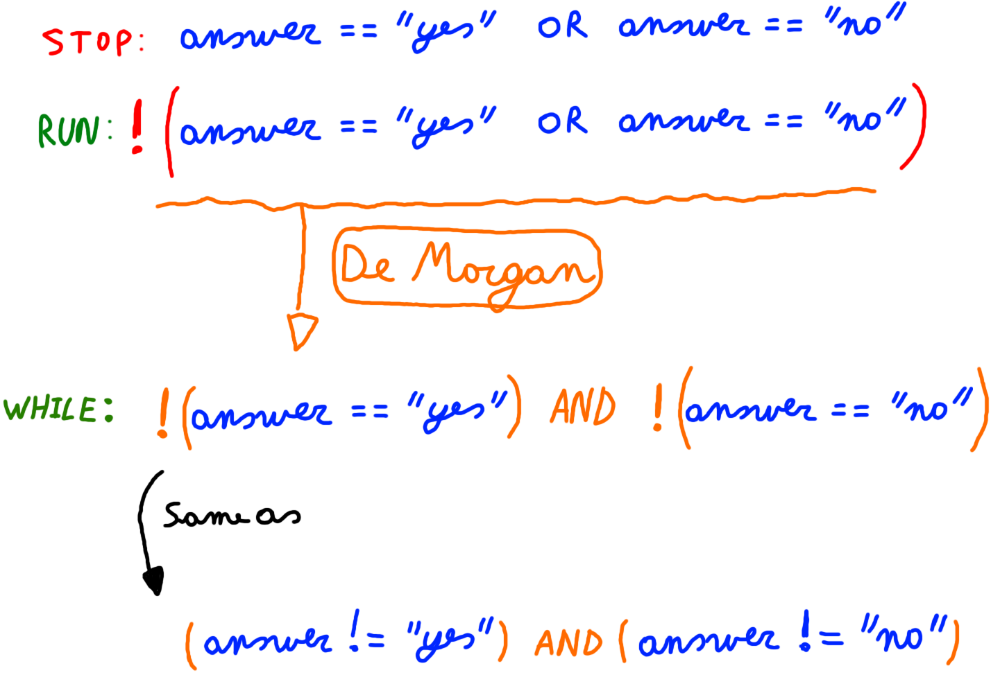

## The do-while loop

A do-while loop is used when the code block needs to be executed at least once. After the first iteration a condition is checked which determines if the code block should be executed again or not.

The do-while loop adheres to the following construction template:

```java
do {
  // Code block
} while (condition);
```

Take note that after the closing round bracket a semicolon is required.

The next code examples asks the user to answer 'yes' or 'no' to a question. It keeps asking the user the question until it get's a valid answer.

```java
Scanner console = new Scanner(System.in);

String answer = "";
do {
    System.out.print("Would you like to learn Java ? [yes,no]: ");
    answer = console.nextLine();
} while (!answer.equalsIgnoreCase("yes") && !answer.equalsIgnoreCase("no"));
```

The condition in the while statement above may seem contradictory at the beginning. If you need to model more complex conditions it is sometimes necessary to build them step by step.

The following diagram shows a step by step method for building the condition above.



1. First determine the condition necessary to stop the while loop. In this case that is when the user answers either "yes" or "no".
2. Next invert the whole condition to use it with a while loop. This is actually the necessary condition to keep the while loop running.
3. Next you can simplify the condition by using De Morgan's laws

Note that Strings are actually objects and we cannot use the simple comparison operator `==`. This would actually compare the references and not the content of the objects. More on this later.
