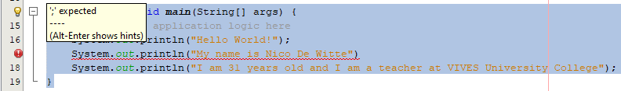
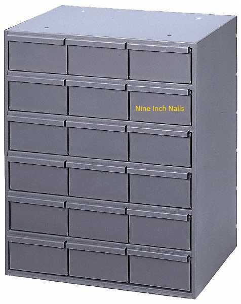

<!-- toc -->

# Starting in Java

This chapter lays the foundation of a simple application. As a reader you will get acquainted with the basic building blocks of programming language.

## Hello World

A "Hello World!" program is a computer program that outputs or displays "Hello World!" to the user. Being a very simple program in most programming languages, it is often used to illustrate the basic syntax of a programming language for a working program. It is often the very first program people write when they are new to the language.

![Hello World [^1]](img/hello_world.jpg)

[^1]: Source https://www.haikudeck.com/test-deck-uncategorized-presentation-0b3abf30c5

A "Hello world!" program is often used to introduce novice programmers to a programming language. In general, it is simple enough to be understood easily, especially with the guidance of a teacher or a written guide.

In addition, "Hello world!" can be a useful sanity test to make sure that a language's compiler, development environment, and run-time environment are correctly installed. Configuring a complete programming toolchain from scratch to the point where even trivial programs can be compiled and run can involve substantial amounts of work. For this reason, a simple program is used first when testing a new tool chain.

"Hello world!" is also used by computer hackers as a proof of concept that arbitrary code can be executed through an exploit where the system designers did not intend code to be executed—for example, on Sony's PlayStation Portable. This is the first step in using homemade content ("home brew") on such a device.

![Hello World on PSP [^2]](img/psp_hello_world.jpeg)

[^2]: Source https://en.wikipedia.org/wiki/%22Hello,_World!%22_program

### Hello World in Java

Let's jump right in and create a "Hello World" application in Java.

Open NetBeans and create a new Project by selecting "File => New Project => Java Application". Give is a sensible name such as "HelloWorld".

It will automatically generate an empty application with the code shown below.

> #### Info::Console Applications
>
> When developing applications a choice must be made between a GUI and a console application.
> As discussed earlier, a console application has no real graphical user interface and interacts
> with the user via the terminal (console). The only option for input and output are essentially text.
> This course will focus on console applications. Object Oriented Programming 2 will introduce JavaFX
> allowing the creation of graphical applications in Java.

```java
/*
 * To change this license header, choose License Headers in Project Properties.
 * To change this template file, choose Tools | Templates
 * and open the template in the editor.
 */
package helloworld;

/**
 *
 * @author Nico De Witte
 */
public class HelloWorld {

    /**
     * @param args the command line arguments
     */
    public static void main(String[] args) {
        // TODO code application logic here
    }
}
```

Running this application will output something like shown below.

```java
BUILD SUCCESSFUL (total time: 0 seconds)
```

While not diving into many details there are however a couple of things which can be clarified about the code above.

First of all, not all lines of text that are shown in the program are considered code. Some are actually comments which are not executed. There are
two ways in Java to indicate that some text is a comment. The first is prepending a double slash `//` before your comment. This needs to
be placed before each line of comments.

```java
// This is a line of comments
// This is another line of comments
// Yet again some comments
```

Because this can be a bit of a nuisance when you have a big block of comments, you can also place
`/*` before your block and `*/` after the block (also called a block-comment). This allows a programmer to easily create a paragraph as comments.

```java
/*
  This is a bigger paragraph
  that consists of multiple lines.
  It is typically also called a block-comment.
  */
```

Do note that the initial code shows an `*` before each line in a block-comment. This is a special notation that is called Javadoc. It allows automatic generation
of Javadoc manual pages similar to the Java API at https://docs.oracle.com/javase/8/docs/api/. More information about Javadoc can be found at http://www.oracle.com/technetwork/java/javase/documentation/index-137868.html.

> #### Warning::Too much Information
>
> It is completely normal as a beginning programmer to place a lot of comments inside your code.
> While this is helpful when learning to program, it is also kind of dangerous. Code typically changes while
> the project evolves and often comments do not. They can therefore contain wrong information about the code
> and become useless and even misleading.
> A good programmer (one that takes care of code) will not need a lot of comments. The best documentation is the code
> itself, of course provided that you take care of your naming of things and your code in general.

A second important part of your first program in Java is the main method shown again below.

```java
public static void main(String[] args) {
    // TODO code application logic here
}
```

This piece of code needs to be in every Java program and is the start-point of your program. Without it your program would not be able to be executed.
It is also called the **entry-point of the application**.

The piece of code shown above is also more general known as a **method**. A method consists of some code that can be executed by **calling** it somewhere else in
your code using the name of the method. Here the name of the method is `main`. Most of the applications that are used as examples in this chapter will contain
code that needs to be placed inside this main method, between the curly braces `{}`. That is why NetBeans provides the comment inside the curly braces, to show new programmers
where to place their first lines of code.

From this point forward most code outside of the main method will not be shown anymore unless something needs to change to the standard code.
This because it will mostly stay the same (apart from the actual name of the application which will change if you create a new project).

Let's start by creating the famous "Hello World" application. For this a single line of code must be added inside the curly braces of the *main* method which
outputs the text `Hello World` to the console.

```java
public static void main(String[] args) {
    // TODO code application logic here
    System.out.println("Hello World!");
}
```

A lot can be said about this single line of code.

```java
System.out.println("Hello World!");
```

Most lines of code such as shown above are called `statements`. A statement is an action that is performed in code, often acting on some part of data or information.
In the example above, the information is a piece of text, namely "Hello World!".
This piece of text is called a **String** in programming languages and is most often specified between two quotes `"Place some text between quotes to make a string"`.
A statement is also typically terminated using a semicolon `;`. By placing this at the end of a statement, the Java interpreter knows that the line of code has ended.

If you run the code you will get the following result inside the terminal:

```text
Hello World!
BUILD SUCCESSFUL (total time: 0 seconds)
```

The first example also showed the "BUILD SUCCESSFUL (total time: 0 seconds)" part so this is not new (and this will not be shown in this course anymore from this point on).
However before that, the text "Hello World!" was outputted
to the terminal. This immediately explains what the new line of code does. It outputs some text to the terminal.

Actually `println` is the name of a method that prints a new line of text to the terminal every time it is used. Try placing multiple statements with `println` below each other, every time with a different string. For example

```java
public static void main(String[] args) {
    // TODO code application logic here
    System.out.println("Hello World!");
    System.out.println("My name is Nico De Witte");
    System.out.println("I am 31 years old and I am a teacher at VIVES University College");
}
```

This will result in the following output:

```text
Hello World!
My name is Nico De Witte
I am 31 years old and I am a teacher at VIVES University College
```

Notice how every statement in the code is terminated (ended) with a semicolon. Also note that `println`
starts a new line every time it is called with a string to display. The string we provide to `println` is
called an **argument**. It is a piece of information that is given to a method so it can be used inside the
method - to be displayed, processed or handled in another way.

Forgetting to place a semicolon at the end of a statement will throw of the Java interpreter and generate what is known as syntax error.
Take for example the code below where the second `println` has not terminated correctly. In this case NetBeans will warn you, even
before actually running the code. It will generate a message stating that a `;` is expected. The line of code will also be marked
using red squiggly lines below the code. If you hover over the exclamation mark on the left side, the message *; expected* is shown.

```java
public static void main(String[] args) {
    // TODO code application logic here
    System.out.println("Hello World!");
    System.out.println("My name is Nico De Witte")
    System.out.println("I am 31 years old and I am a teacher at VIVES University College");
}
```



Strings can be concatenated in Java by placing a `+` sign between the different parts. Java can also concatenate strings
with other types such as numbers. When Java detects that a string is required for an operation, it will automatically
try to convert the given information to a string. The code below shows different examples of string concatenations.

```java
public static void main(String[] args) {
    // TODO code application logic here
    System.out.println("It is now " + "7:44 PM");
    System.out.println("My class counts " + 18 + " students");
    System.out.println("I am currently about " + 980106323 + " seconds old");
    System.out.println("Number of cats in my house: " + 0);
    System.out.println("I am " + 1.86 + "meters tall");
}
```

This code outputs:

```text
It is now 7:44 PM
My class counts 18 students
I am currently about 980106323 seconds old
Number of cats in my house: 0
I am 1.86 meters tall
```

The code above shows both integer numbers and floating point numbers. Floating point numbers
use a point `.` as a decimal separator when specifying floating point numbers.

The `println` method also has a variant which does not print a new line at the end of the string.
This method is called `print`. A newline can be displayed by
calling `println` with an empty string `""` as argument or you can add a special character `\n` inside your string
to output newlines. The code below shows examples of all these techniques.

```java
public static void main(String[] args) {
    // TODO code application logic here
    System.out.print("You can also print ");
    System.out.print("text to the terminal ");
    System.out.print("without starting a newline.");
    System.out.println("");   // Force a newline
    System.out.print("Or you can also force newlines\nusing escape characters.\n");
    System.out.print(".............\n\n");
}
```

Which outputs

```text
You can also print text to the terminal without starting a newline.
Or you can also force newlines
using escape characters.
.............

BUILD SUCCESSFUL (total time: 0 seconds)
```

More information about escape characters can be found at https://en.wikipedia.org/wiki/Escape_character.

## Storing and using information

The programs that we create need to store all sorts of data. From simple things such as
numbers, characters and string to complex data types that a programmer can define for himself.

This data is stored, manipulated and outputted through our application. The data itself
is stored inside the memory of the computer or system the program is running on. Inside your application
you do not need to access the memory directly, for this you can make use of variables.

### Variables

A variable is a **symbolic name** for information. The variable's name should represent what information the variable contains.
They are called variables because they represent *information that can change*.

Computer memory can be thought of a huge cabinet with millions of small drawers. The content of the drawers is the information
stored in memory that we use inside our application. While it is perfectly possible to refer to a drawer using its location (for example
second row, third column), it is a lot harder to remember. There is also no link between the location and the actual content of the drawer.
Now if we place a label on the drawer that is descriptive enough of its content, which is the analogy of our variable name, it is much easier to refer to the drawer using the descriptive name (for example nine inch nails).



As a student you actually have already been using variables for quite a while. When doing math you also use symbolic names for variables. For example

```text
x = 15
y = 13

p = x * y
```

Or when defining a linear equation

```text
y = f(x) = ax + b
```

### Declaring a variable

Before a variable can be used inside an application, it needs be **declared**. Declaring a variable can be thought of as stating to the Java interpreter
that is needs to request memory for data and make it accessible using a symbolic variable name. Because the Java interpreter
needs to know how much memory to set aside, you as a programmer need to specify what **type of data** the variable will hold.

The type of the variable determines the size and layout of the variable's memory; the range of values that can be stored within that memory; and the set of operations that can be applied to the variable.

Once you provided the type and name, the variable can be used to store data.

Let's take a look at an example where a variable stores the age of a person. In this case we need to define the variable to be of an *integral type*. In Java
the data type is `int` (integer) for this, which can store *whole signed numbers*.

```java
public static void main(String[] args) {

    // Declaring a variable of type integer
    // and make it accessible using the symbolic name ageOfPerson
    int ageOfPerson;

    // Assign a value to the variable
    ageOfPerson = 31;

    // The variable name can also be used to retrieve the data
    System.out.println("I am " + ageOfPerson + " years old and I am a teacher at VIVES University College");
}
```

The data referred to by the variable can be changed using the **assignment operator** `=`. This is basically the same as in
math. On the left side you have the variable which you want to assign and on the right hand the value.

When you wish to use the content of the variable, all you need to do is state the symbolic name where you would otherwise
use a value.

This also means that one variable can be used to assign a value to another.

```java
public static void main(String[] args) {
  int numberOfStudents;
  numberOfStudents = 36;

  int numberOfEmailAddresses;
  numberOfEmailAddresses = numberOfStudents;

  System.out.println("We have " + numberOfStudents + " students meaning we also have " + numberOfEmailAddresses + " email addresses");
}
```

Note how the variable is declared (created by stating a type and name) before it is used. The following code is therefore flawed and will not run:

```java
public static void main(String[] args) {
  numberOfStudents = 36;
  numberOfEmailAddresses = numberOfStudents;

  System.out.println("We have " + numberOfStudents + " students meaning we also have " + numberOfEmailAddresses + " email addresses");

  int numberOfEmailAddresses;
  int numberOfStudents;
}
```

> #### Hint::Declare a variable before using it
>
>  You must declare a variable before it can be used.

While the code below is perfect working code, you will not often see it being written by a more experienced programmer:

```java
public static void main(String[] args) {
  int numberOfStudents;
  numberOfStudents = 36;
}
```

This because when a variable is declared, you can **immediately initialize it** with a value in a single line of code as shown below.

```java
public static void main(String[] args) {
  int numberOfStudents = 36;
}
```

It is important to always initialize a variable before using it. If you use the variable before initializing it, you may create bugs in your program. Often Java
will not even allow the usage of a variable if it is not initialized. This safety net is not provided by all programming languages. For example C++ will allow you to use uninitialized variables. In this case their value is undetermined and often contains the values of the previous program that used that same location in memory.

### Primitive data types

The `int` (integer) data type is called a **primitive data type**. Primitive data types are simple data types that are integrated in the programming language itself (they are most of the time keywords in the language). They form the base of all data storage inside your application. While more complex data types are available, or can even be created by us, in the end it always comes down to primitive data types storing the actual data.

Integer is not the only type that is supported by Java. A full overview of the different primitive data types is given below.

* `byte`: The byte data type is an 8-bit signed two's complement integer. It has a minimum value of -128 and a maximum value of 127 (inclusive). The byte data type can be useful for saving memory in large arrays, where the memory savings actually matters.

* `short`: The short data type is a 16-bit signed two's complement integer. It has a minimum value of -32,768 and a maximum value of 32,767 (inclusive). As with byte, the same guidelines apply: you can use a short to save memory in large arrays, in situations where the memory savings actually matters.

* `int`: By default, the int data type is a 32-bit signed two's complement integer, which has a minimum value of -2^31 and a maximum value of 2^31-1.

* `long`: The long data type is a 64-bit two's complement integer. The signed long has a minimum value of -2^63 and a maximum value of 2^63-1.

* `float`: The float data type is a single-precision 32-bit IEEE 754 floating point. Its range of values is 3.40282347 x 10^38 to 1.40239846 x 10^-45. As with the recommendations for byte and short, use a float (instead of double) if you need to save memory in large arrays of floating point numbers. This data type should never be used for precise values, such as currency.

* `double`: The double data type is a double-precision 64-bit IEEE 754 floating point. Its range of values is 1.7976931348623157 x 10^308, 4.9406564584124654 x 10^-324. For decimal values, this data type is generally the default choice. As mentioned above, this data type should never be used for precise values, such as currency.

* `boolean`: The boolean data type has only two possible values: `true` and `false`. Use this data type for simple flags that track true/false conditions. This data type represents one bit of information, but its "size" isn't something that's precisely defined.

* `char`: The char data type is a single 16-bit Unicode character. It has a minimum value of 0 and a maximum value of 65,535 inclusive.

Examples of variable declarations of different data types:

```java
int numberOfStudents = 55;              // Simple integer

char startOfAlfabet = 'a';              // Characters (from the alfabet) or other symbols
char dollarSign = '$';
char endOfLine = '\n';

// Floating point numbers
float averageWaterUseage = 3870.35478;  
double averageStudentScore = 12.5;      

// Booleans can only be true or false
boolean isOlderThanEighteen = true;
boolean isStillATeenager = false;
```

A string in Java is always placed between double quotes, for example `"Hello my name is Nico"`. A single character is placed between single quotes, as also seen in the example code above. Special characters, such as an end-of-line `'\n'` can also be stored in a variable of type char.

A character preceded by a backslash `\` is an escape sequence and has special meaning to the compiler. The following table shows the Java escape sequences:

|Escape Sequence |	Description|
| ------ | -------|
|`\t` |	Insert a tab in the text at this point.|
|`\b` |	Insert a backspace in the text at this point.|
|`\n` |	Insert a newline in the text at this point.|
|`\r` |	Insert a carriage return in the text at this point.|
|`\f` |	Insert a formfeed in the text at this point.|
|`\'` |	Insert a single quote character in the text at this point.|
|`\"` |	Insert a double quote character in the text at this point.|
|`\\` |	Insert a backslash character in the text at this point.|

These escape characters can be used inside a string or can be stored in a variable of type `char`.

```java
public static void main(String[] args) {
    System.out.println("There\tis\ta\ttab\tbetween\teach\tword");
    System.out.println("You can also use quotes here but the need to be escaped:");
    System.out.println("--------------------------------------------------------");
    System.out.println("\"C makes it easy to shoot yourself in the foot; C++ makes it harder,\nbut when you do it blows your whole leg off.\"");
    System.out.println("by Bjarne Stroustrup");
    System.out.println("--------------------------------------------------------");
}
```

Which generates the following output:

```text
There	is	a	tab	between	each	word
You can also use quotes here but the need to be escaped:
--------------------------------------------------------
"C makes it easy to shoot yourself in the foot; C++ makes it harder,
but when you do it blows your whole leg off."
by Bjarne Stroustrup
--------------------------------------------------------
```

## Mathematical Operators

The Java programming languages has a lot of operators. Two operators have already been discussed, namely the assignment operator `=` and the string concatenation operator `+`.

The most basic operators are the mathematical operators. They are easy to understand because they have the same function as in math. The following operators are available to do basic math operations:

* `+` Additive operator (also used for String concatenation)
* `-` Subtraction operator
* `*` Multiplication operator
* `/` Division operator
* `%` Remainder operator

These operators are part of the **binary operators** because they take **two operands**, namely a left and a right operator. For example in the summation below `L` is the left operand and `R` is the right operand. The result of the operation is stored in the variable `sum`.

```java
int R = 14;
int L = 12;

int result = R + L;     // Result is now 26
```

The `+`, `-` and `*` operators function the same as in math. Their use can be seen in the code below.

```java
int a = 2 + 3;      // a = 5
int b = a + 5;      // b = 10

int c = 6 * b;      // c = 60
int d = c - 120;    // d = -60
```

The division and remainder operators deserve some special attention. The division operator has a different result based on the types of its left and right operand. If both are of an integral type (`short`, `int`, `byte`) then a whole division will be performed. Meaning that `3 / 2` will result in `1`. If either operand is a floating point operand (`float` or `double`) than the division operator will perform a real division: `3.0 / 2` will result in `1.5`.

If your operands are of integral type and you wish to perform a real division, you can always multiply one of the operands with `1.0` to explicitly convert it to a floating point number without having to change its actual data type. Let us take a look at some examples.

```java
int x = 5;
int y = 2;

int z = x / y;              // z = 2 (whole division)
double w = x / y;           // w = 2.0 (still whole division)
double q = 1.0 * x / y;     // w = 2.5 (real division)

double a = 3.0;
double b = 2;       // 2 will actually be converted to 2.0

double k = a / b;   // k = 1.5 (real division)
```

Notice that even `double w = x / y;` results in `2.0`. The reason behind this is that `x / y` equals to `2` as it is a whole division since both operand are of integral type. The result is then implicitly converted to a double, and stored in `w`.

While the order in which mathematical operations are performed is defined in Java, most programmers do not know all of them by heart. It is much more clear and simpler to use round brackets `()` to enforce the order of the calculations. Take a look at the following piece of code:

```java
int a = 5;
int b = 6;
int c = 10;
int d = 2;

int result = a * b + c - d * a / 5 - 3;     // result = 35

System.out.println("The result is " + result);
```

The result of the code above is `35`. Would you have known? By using round brackets this becomes much clearer and the change of making a mistake is a lot smaller.

```java
int a = 5;
int b = 6;
int c = 10;
int d = 2;

int result = (a * b) + c - (d * a / 5) - 3;     // result = 35

System.out.println("The result is " + result);
```


<!-- Naming is case sensitive -->


<!-- Operators -->
<!-- If else -->
<!-- Doing things twice - loops -->
<!-- Programming in Style -->
