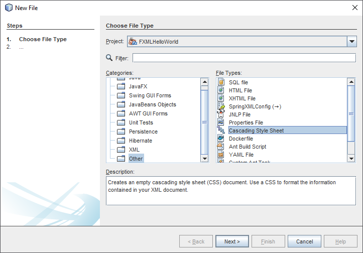

## Cascading Style Sheets

Never has styling a Java UI been easier than with JavaFX and **Cascading Style Sheets (CSS)**. Going from one theme to another, or customizing the look of just one control, can all be done through CSS.

### CSS and the JavaFX Scene Graph

JavaFX Cascading Style Sheets (CSS) is based on the W3C CSS version 2.1 with some additions from current work on version 3. JavaFX CSS also has some extensions to CSS in support of specific JavaFX features. The goal for JavaFX CSS is to allow web developers already familiar with CSS for HTML to use CSS to customize and develop themes for JavaFX controls and scene‑graph objects in a natural way.

To the extent possible, JavaFX CSS follows the W3C standards; however, with few exceptions, JavaFX property names have been prefixed with a vendor extension of `-fx-`. Even if these properties seem to be compatible with standard HTML CSS, JavaFX CSS processing assumes that the property values make use of JavaFX CSS extensions.

CSS styles are applied to nodes in the JavaFX scene‑graph in a way similar to the way CSS styles are applied to elements in the HTML DOM. Styles are first applied to the parent, then to its children. The code is written such that only those branches of the scene‑graph that might need CSS reapplied are visited. A node is styled after it is added to the scene graph. Styles are reapplied when there is a change to the node's pseudo‑class state, style‑class, id, inline style, or parent, or stylesheets are added to or removed from the scene. Note that the Node must be in the scene‑graph for CSS to be applied. The Node does not have to be shown, but must have a non‑null value for its sceneProperty.

During a normal scene‑graph pulse, CSS styles are applied before the scene‑graph is laid out and painted.

CSS selectors are used to match styles to scene‑graph nodes. The relationship of a Node to a CSS selector is as follows:

Each node in the scene‑graph has a styleClass property. Note that a node may have more than one style‑class. A Node's styleClass is analogous to the class="..." attribute that can appear on HTML elements.

Each node in the scene‑graph has an id variable, a string. This is analogous to the id="..." attribute that can appear HTML elements.

JavaFX CSS also supports pseudo‑classes, but does not implement the full range of pseudo‑classes.

More information can be found at [https://docs.oracle.com/javafx/2/api/javafx/scene/doc-files/cssref.html](https://docs.oracle.com/javafx/2/api/javafx/scene/doc-files/cssref.html).

### Creating a CSS file

To add a stylesheet to your application start by creating a `.css` file inside your application (NetBeans) by right clicking the project and selecting `New => Other => Other => Cascading Style Sheet` as show in the screenshot below. Name it as you wish.



The actual styling is left as an exercise to the reader of this course. A Dark themed example is shown below which can be used to test. Credits go out to [http://code.makery.ch/library/javafx-8-tutorial/part4/](http://code.makery.ch/library/javafx-8-tutorial/part4/).

```css
.background {
    -fx-background-color: #1d1d1d;
}

Label {
    -fx-font-size: 11pt;
    -fx-font-family: "Segoe UI Semibold";
    -fx-text-fill: white;
    -fx-opacity: 0.6;
}

MenuBar {
    -fx-background-color: derive(#1d1d1d,20%);
}

MenuBar .label {
    -fx-font-size: 14pt;
    -fx-font-family: "Segoe UI Light";
    -fx-text-fill: white;
    -fx-opacity: 0.9;
}

/*Menu dropdown*/
.context-menu {
    -fx-background-color: derive(#1d1d1d,50%);
}

TextField {
    -fx-font-size: 12pt;
    -fx-font-family: "Segoe UI Semibold";
}

Button {
    -fx-padding: 5 22 5 22;   
    -fx-border-color: #e2e2e2;
    -fx-border-width: 2;
    -fx-background-radius: 0;
    -fx-background-color: #1d1d1d;
    -fx-font-family: "Segoe UI", Helvetica, Arial, sans-serif;
    -fx-font-size: 11pt;
    -fx-text-fill: #d8d8d8;
    -fx-background-insets: 0 0 0 0, 0, 1, 2;
}

Button:hover {
    -fx-background-color: #3a3a3a;
}

Button:pressed, Button:default:hover:pressed {
  -fx-background-color: white;
  -fx-text-fill: #1d1d1d;
}

Button:focused {
    -fx-border-color: white, white;
    -fx-border-width: 1, 1;
    -fx-border-style: solid, segments(1, 1);
    -fx-border-radius: 0, 0;
    -fx-border-insets: 1 1 1 1, 0;
}

Button:default {
    -fx-background-color: -fx-focus-color;
    -fx-text-fill: #ffffff;
}

Button:default:hover {
    -fx-background-color: derive(-fx-focus-color,30%);
}
```

To load the CSS file the simplest option is to add it as an attribute to the FXML root Node:

```xml
<VBox prefHeight="400.0" prefWidth="640.0" xmlns="http://javafx.com/javafx/9.0.1" xmlns:fx="http://javafx.com/fxml/1" fx:controller="fxmlwalktheplank.WalkThePlankController"
    stylesheets="@darktheme.css">
```

As most styles are applied to the Node class names they will be applied automatically. However the background needs to be set as the `Style Class` for the root Node.

```xml
<VBox prefHeight="400.0" prefWidth="640.0" xmlns="http://javafx.com/javafx/9.0.1" xmlns:fx="http://javafx.com/fxml/1" fx:controller="fxmlwalktheplank.WalkThePlankController"
    stylesheets="@darktheme.css" styleClass="background">
```

This can also be done from inside Scene Builder.
