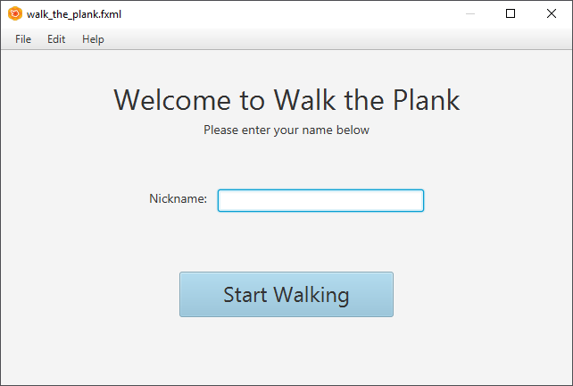
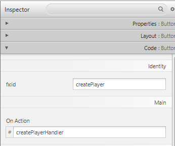

## Event Handling

In JavaFX applications, events are notifications that something has happened. As a user clicks a button, presses a key, moves a mouse, or performs other actions, events are dispatched. Registered event filters and event handlers within the application receive the event and provide a response.

Take a simple player login form where a player is asked to provide a nickname and press a button to start the game when ready.



The FXML document, game logic classes and controller can be found at the Github repository: [https://github.com/BioBoost/object-oriented-programming-using-java/tree/master/starting_with_javafx/code/FXMLWalkThePlank/](https://github.com/BioBoost/object-oriented-programming-using-java/tree/master/starting_with_javafx/code/FXMLWalkThePlank/). Feel free to use it or create your own from scratch.

When creating a new FXML file from Scene Builder and importing it afterwards into a JavaFX application you may need to change the name of loaded file inside the `start()` method where the FXML file is loaded. You will also need to specify the name of the controller inside the FXML file root node. For example for the Controller `WalkThePlankController` inside the package `fxmlwalktheplank` that would be:

```xml
<VBox prefHeight="400.0" prefWidth="640.0" xmlns="http://javafx.com/javafx/9.0.1" xmlns:fx="http://javafx.com/fxml/1" fx:controller="fxmlwalktheplank.WalkThePlankController">
```

### A Button Handler

The idea is to create a Player instance when the user presses the button and output the instance as a string to the terminal. A simple Player class implementation could be:

```java
package gamelogic;

public class Player {
    private String nickname;
    private int points = 0;

    public Player(String nickname) {
        this.nickname = nickname;
    }

    @Override
    public String toString() {
        return "Player " + nickname + " has " + points + " points.";
    }
}
```

For this we first need to register a button handler for the `createPlayer` button, where `createPlayer` is the id of the button. This is achieved my opening the FXML file in Scene Builder, selecting the button and setting the method name at `Code => On Action` in the Inspector panel as shown below. Take for example a handler name `createPlayerHandler`.



Next a method with that exact name needs to be created inside the Controller. It should also take an event as an argument, which is of type `ActionEvent`. This object can later be used to identify the control that triggered the event. The `@FXML` is mandatory for private members for the automatic binding with the view to work. It is optional for public members.

```java
public class WalkThePlankController implements Initializable {
    @FXML
    private void createPlayerHandler(ActionEvent event) {
        System.out.println("Clicked the create player button");
    }

    @Override
    public void initialize(URL url, ResourceBundle rb) {
    }    
}
```

### Retrieving Data from the View

To be able to instantiate a Player object, the nickname that the user provided in the `TextField` needs to be retrieved first.

For this we first need a reference to the actual `TextField` object that is automatically created by the FXML loader. This can be achieved by adding a private `TextField` attribute to the controller with the same name as the id of the `TextField` node in the FXML file. Since it is private, an `@FXML` annotation should be added before it. Then the reference can be used to retrieve the String entered by the user using the method `getText()`.

```java
public class WalkThePlankController implements Initializable {
    @FXML private TextField nickname;

    @FXML
    private void createPlayerHandler(ActionEvent event) {
        String playerNickname = nickname.getText();
        System.out.println("Nickname = " + playerNickname);
    }

    @Override
    public void initialize(URL url, ResourceBundle rb) {
    }    
}
```

To create a Player object we need to add an attribute of type Player to the controller and instantiate it once the user presses the button as shown below.

```java
public class WalkThePlankController implements Initializable {
    private Player player;

    @FXML private TextField nickname;

    @FXML
    private void createPlayerHandler(ActionEvent event) {
        String playerNickname = nickname.getText();
        player = new Player(playerNickname);
        System.out.println("Created new player: " + player);
    }

    @Override
    public void initialize(URL url, ResourceBundle rb) {
    }    
}
```

### Registering an Event Handler from Code

It is also possible to register an event handler from inside your Java code using what is called an inner class implementation of EventHandler:

```java
public class WalkThePlankController implements Initializable {

    private Player player;

    @FXML private TextField nickname;
    @FXML private Button createPlayer;

    @Override
    public void initialize(URL url, ResourceBundle rb) {
        createPlayer.setOnAction(new EventHandler<ActionEvent>() {
            @Override
            public void handle(ActionEvent event) {
              String playerNickname = nickname.getText();
              player = new Player(playerNickname);
              System.out.println("Created new player: " + player);
            }
        });
    }    
}
```

The actual implementation of the handler itself is exactly the same. However some notes can be made:
* First a reference to the `createPlayer` is required to be able to register the event handler
* The event handler can be registered by calling the method `setOnAction()` inside the `initialize()` method (which kind of functions as a constructor here).
* The name of the `handle()` method cannot be chosen as before. Here it is imposed by the `EventHandler` interface

Luckily most of this can be automatically generated by NetBeans. We will come back to these types of constructions later on in this course.
