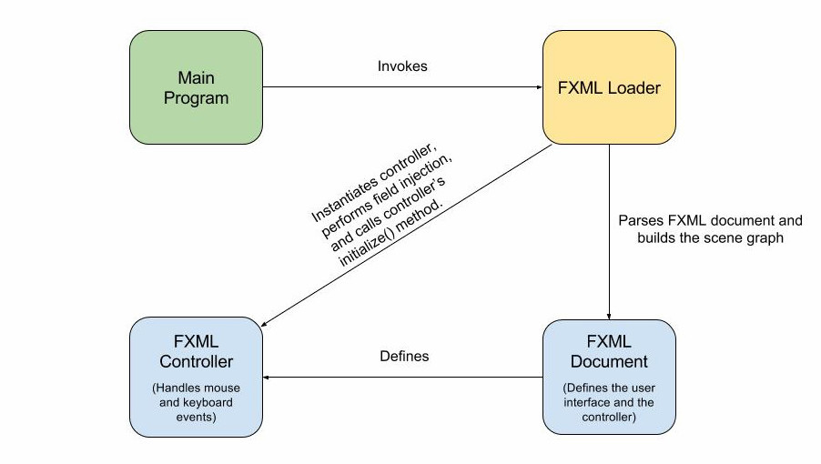

## FXML

FXML is a scriptable, XML-based markup language for constructing Java object graphs. It provides a convenient alternative to constructing such graphs in procedural code, and is ideally suited to defining the user interface of a JavaFX application, since the hierarchical structure of an XML document closely parallels the structure of the JavaFX scene graph.

A designer can code in FXML or use JavaFX Scene Builder to interactively design the graphical user interface (GUI). Scene Builder generates FXML markup that can be ported to an IDE where a developer can add the business logic.

To create a new JavaFX FXML application, launch NetBeans and select `File => New Project => JavaFX => JavaFX FXML Application`.

### Model View Controller

If you take a look at a newly created JavaFX FXML application you will notice multiple files were created.


This structure follows a design pattern called the Model-View-Controller pattern, a well known pattern in the world of web development.

Perhaps the most well known pattern, also the one that many will get wrong and implement in an even worse way. The MVC pattern arose as a solution to keep 3 concerns separate from each other: visuals (View), data (Model), and logic (Controller). The pattern is easy to understand but hard to implement given that its generic description: a triangle where all parts can communicate with each other. Problem is, the links between some parts may be passive, for example some claim the View may only read the Model but do not update it directly, where as others claim data flows equally both ways.

The following diagram presents one of the many ways in which this pattern may be implemented; the dotted lines represent passive links.


From a Model View Controller (MVC) perspective, the FXML file that contains the description of the user interface is the view. The controller is a Java class which is declared as the controller for the FXML file. The model consists of domain objects, defined on the Java side, that you connect to the view through the controller.

### Structure of a JavaFX FXML application

As depicted in the figure, the user interface of an FXML application is defined inside an FXML document and all the logic to handle input events are written inside a controller class.



The execution of the program begins with the Main class, which invokes the FXML loader. The FXML loader parses the FXML document, instantiates the nodes specified in the document, and builds the scene graph.

After building the scene graph, the FXML loader instantiates the controller class, injects the fields defined in the controller class with objects instantiated from the FXML document and then calls the controller’s initialize() method.

All this is done with a few lines of codes:

```java
public class FXMLHelloWorld extends Application {
  @Override
  public void start(Stage stage) throws Exception {
    Parent root = FXMLLoader.load(getClass().getResource("FXMLDocument.fxml"));
    Scene scene = new Scene(root);
    stage.setScene(scene);
    stage.show();
  }

  public static void main(String[] args) {
    launch(args);
  }
}
```
