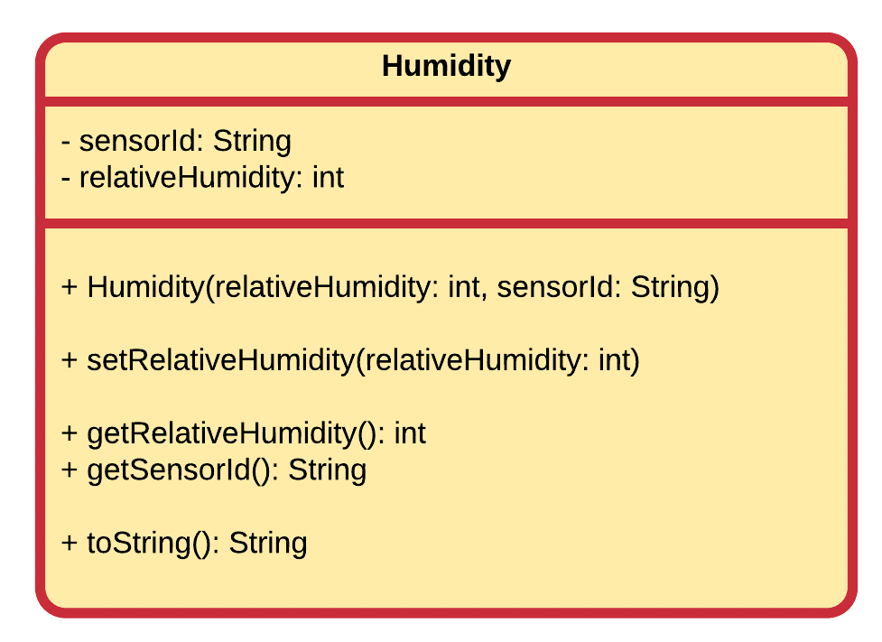
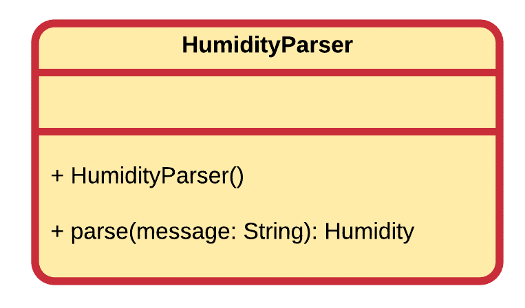

## Exam Assignment 2017 (OOP1)

Humidity (vochtigheid) geeft de hoeveelheid waterdamp aan die er zich in de lucht bevindt. Zonder waterdamp in de lucht zouden we een gelijkaardig klimaat krijgen aan dit op mars en zouden we ook geen regen, sneeuw, mist, … hebben. Meestal wordt dit uitgedrukt in %, waar we dan eigenlijk te maken hebben met de relatieve vochtigheid. Een relatieve vochtigheid van 100% betekent dat de lucht verzadigd is, in welk geval het waarschijnlijk zal regenen.

Veronderstel nu dat we een klein weerstation maken als Elektronica/ICT’er en dit achteraan de in de tuin plaatsen. We wensen ook een mooie applicatie te maken om de gegevens bij te houden die dit station genereerd. Voor dit examen beperken we ons tot de vochtigheid die de temperatuur/vochtigheidssensor ons aflevert.

Modeleer een class in Java die Humidity heet (volg het UML-class diagram strikt op).



De class Humidity bevat twee attributen:
* sensorId: een String die een unieke identificatie zal bevatten van de sensor waar de meting van afkomstig is (in geval we meerdere sensoren hebben).
* relativeHumidity: een procentuele waarde die de relatieve humidity bijhoud als een integer. Belangrijk hier is dat deze waarde nooit kleiner dan 0% of groter dan 100% mag worden.

Voor beide attributen moeten de overeenkomstige getters worden voorzien. De class bevat een constructor die zowel de vochtigheid als het sensor id binnen neemt.

Er dient enkel een setter te worden voorzien voor de vochtigheid. Deze moet de waarde binnen de geldige range houden. Als de opgegeven waarde buiten de range valt moet je deze beperken tot het minimum (0%) of het maximum (100%). Zorg er ook voor dat deze beveiliging in de constructor zit vervat.

Implementeer de toString methode zodat deze volgende voorstelling van de Humidity teruggeeft:
```json
{"sensor": "garage", "relative_humidity": 85}
```

De quotes (") kan je in een String plaatsen door deze te escapen (door er een slash voor te plaatsen zoals met \n).

Vervolgens dien je een class HumidityParser te bouwen die een String representatie van een sensorwaarde kan omvormen naar een object van het type Humidity. Een voorbeeld van zo een String representatie ziet er als volgt uit:

```text
|sensor:garage|humid:85|
```

Deze representatie komt van een vochtigheidssensor die om de 5 minuten zijn gemeten waarde aan ons Javaprogramma doorgeeft. Deze String moet je parsen om de naam van de sensor en de relatieve vochtigheid eruit te halen. Zowel "sensor" als "humid" zijn hier vaste keywords. "garage" en "85" zijn veranderlijke waarden.

Je mag er niet vanuit gaan dat de naam van de sensor geen spaties kan bevatten. Je moet hier gebruik maken van de scheidingstekens ("|") en de keywords om de String op te splitsen en de gegevens eruit te kunnen filteren. Je mag er  wel vanuit gaan dat de String altijd een geldige inhoud volgens bovenstaand formaat bevat.



De HumidityParser class dient enkel een methode parse() te bezitten die een sensorwaarde in Stringvorm binnen neemt (via het argument message). Deze dient de String te parsen en vervolgens als een object van de class Humidity te returnen (natuurlijk met de correcte gegevens ingevuld volgens de opgegeven Stringwaarden).

Je mag intern in de class HumidityParser private methodes toevoegen zoals je zelf wenst om je code meer DRY te maken.

De volgende pagina's bevatten methodes van de class String die je eventueel nodig zal hebben, namelijk substring(), indexOf() en length(). Voor het omzetten van Strings naar integers kan je gebruik maken van de methode parseInt() van de class Integer. Je mag ook gebruik maken van de cheatsheet op het einde van dit onderdeel.

Opgelet, het parsen van de String kan op verschillende manieren gebeuren. Een werkend eindresultaat is hier het belangrijkst. Als je dus een aantal extra tussenstappen nodig hebt moet je hier zeker niet mee inzitten.

Onderstaand programma zou moeten werken als jouw classes worden geïmplementeerd:

```java
public static void main(String[] args) {
    Humidity garden = new Humidity(33, "garden");
    System.out.println(garden);

    HumidityParser parser = new HumidityParser();
    Humidity garage = parser.parse("|sensor:garage|humid:85|");
    System.out.println(garage);
}
```

En volgende output opleveren:

```json
{"sensor": "garden", "relative_humidity": 33}
{"sensor": "garage", "relative_humidity": 85}
```

### API docs

Of the class String:
* [https://docs.oracle.com/javase/9/docs/api/java/lang/String.html#substring-int-int-](https://docs.oracle.com/javase/9/docs/api/java/lang/String.html#substring-int-int-)
* [https://docs.oracle.com/javase/9/docs/api/java/lang/String.html#indexOf-java.lang.String-int-](https://docs.oracle.com/javase/9/docs/api/java/lang/String.html#indexOf-java.lang.String-int-)
* [https://docs.oracle.com/javase/9/docs/api/java/lang/String.html#length--](https://docs.oracle.com/javase/9/docs/api/java/lang/String.html#length--)

Of the class Integer:
* [https://docs.oracle.com/javase/9/docs/api/java/lang/Integer.html#parseInt-java.lang.String-](https://docs.oracle.com/javase/9/docs/api/java/lang/Integer.html#parseInt-java.lang.String-)

### Solution

The class **Humidity**:

[include](solutions/HumidityApp/src/humidityapp/Humidity.java)

The class **HumidityParser**:

[include](solutions/HumidityApp/src/humidityapp/HumidityParser.java)
