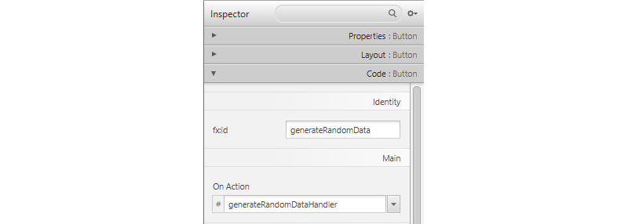

## Step 2 - The Controller

To be able to access the chart from the controller, it needs to be added as an attribute to the controller class. As with any attribute we need to specify the access (`private`, `protected` or `public`), the data type (in our case `LineChart`) and a name for the attribute. To bind it to the visual component, the name of the attribute must be equal to the id of the visual component. Since best-practice dictates us to make attributes `private` an annotation `@FXML` need to be put in front of the attribute so Java can make the binding between the controller attribute and the visual component, even if the attribute is private.

The `Label` attribute from the hello world demo can be removed. This leads us to the following code:

```java
public class FXMLChartDisplayController implements Initializable {

    @FXML private LineChart temperatureChart;

    @FXML
    private void handleButtonAction(ActionEvent event) {
        System.out.println("You clicked me!");
    }

    @Override
    public void initialize(URL url, ResourceBundle rb) {
        // TODO
    }    
}
```

Before we get started with adding actual data, rename the action handler of the button from `handleButtonAction` to `generateRandomDataHandler`. Do this both inside the controller and inside Scene Builder (select the button, navigate to the Code panel and select the new handler for the On Action event).

```java
    @FXML
    private void generateRandomDataHandler(ActionEvent event) {
        System.out.println("You clicked me!");
    }
```


