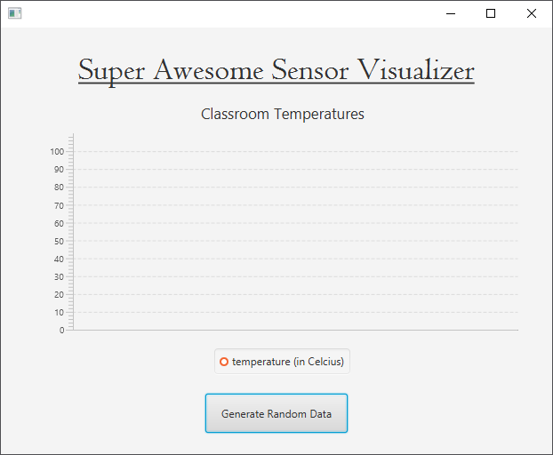
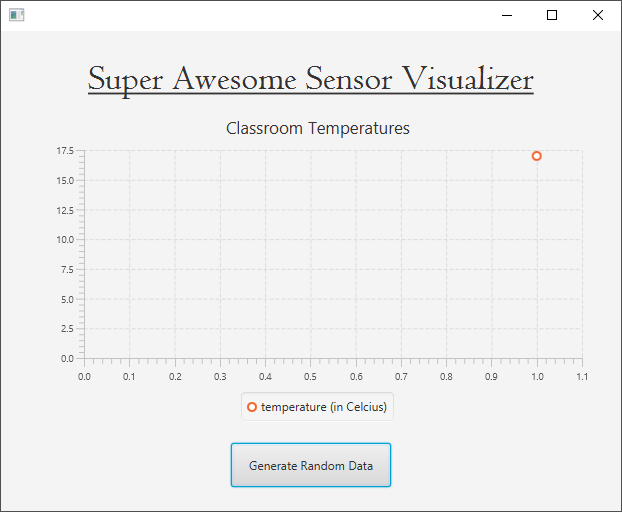

## Step 3 - Adding Data to the LineChart

The best approach is to google for `JavaFX linechart example`. This brings us across a couple of interesting examples such as:
* [http://www.java2s.com/Tutorials/Java/JavaFX/0820__JavaFX_LineChart.htm](http://www.java2s.com/Tutorials/Java/JavaFX/0820__JavaFX_LineChart.htm)
* [https://www.tutorialspoint.com/javafx/line_chart.htm](https://www.tutorialspoint.com/javafx/line_chart.htm)
* [https://docs.oracle.com/javafx/2/charts/line-chart.htm](https://docs.oracle.com/javafx/2/charts/line-chart.htm)

The most useful seems to be the official documentation as it also provides some extra info on what classes and elements are needed to build a chart. So we will go with [https://docs.oracle.com/javafx/2/charts/line-chart.htm](https://docs.oracle.com/javafx/2/charts/line-chart.htm).

The tutorial states that:

> Creating a Line Chart
> To create a line chart, at a minimum, you must define two axes, create the LineChart object by instantiating the LineChart class, create one or more series of data by using the XYChart.Series class, and assign the data to the chart.

However some of these parts we already have. For example, the LineChart object is already created for as when the application starts. This is done automatically because of the FXML file. The axis are also already displayed. However they are incorrect for us. These will need to be changed later on.

Basically we need to create an `XYChart.Series` object and assign it to the current instance our attribute is referring to. We need a reference to this object later on when we want to add new data to the chart, so that is why the series needs to added as an attribute to the controller class as shown below:

```java
public class FXMLChartDisplayController implements Initializable {

    @FXML private LineChart temperatureChart;
    private XYChart.Series temperatureValues;

    // ...
}
```

Our button handler `generateRandomDataHandler` is the method that will add data to the series every time someone presses the button. This means we cannot create the `XYChart.Series` object inside this method, as it will create a new object every time someone presses the button. We need to create the series object one time, for example when the controller is initialized. In other words we can facilitate the `initialize` method of the controller to create our initial data series:

```java
public class FXMLChartDisplayController implements Initializable {

    @FXML private LineChart temperatureChart;
    private XYChart.Series temperatureValues;

    // ...

    @Override
    public void initialize(URL url, ResourceBundle rb) {
        temperatureValues = new XYChart.Series();
        temperatureValues.setName("Temperature (in Celcius)");
    }
}
```

Let add a static value to the chart every time the user clicks the button. The example code shows that a new data point can be added to the series by calling the `getData()` method on the series and passing in a new object of type `XYChart.Data`. Change the implementation of the handler as shown below to add a value of *17* degrees every time a user presses the button.

```java
public class FXMLChartDisplayController implements Initializable {

    // ...

    @FXML
    private void generateRandomDataHandler(ActionEvent event) {
        System.out.println("You clicked me!");
        temperatureValues.getData().add(new XYChart.Data(1, 17));
    }

    // ...
}
```

Something seems to be wrong. Nothing happens to the chart when the button is pressed. Well actually if you take a look at the example code and our code you may notice that we actually never added the series object reference to the actual chart. To solve this bug, change the `initialize` method as shown below:

```java
public class FXMLChartDisplayController implements Initializable {

    // ...

    @Override
    public void initialize(URL url, ResourceBundle rb) {
        temperatureValues = new XYChart.Series();
        temperatureValues.setName("temperature (in Celcius)");

        // Add series to chart
        temperatureChart.getData().add(temperatureValues);
    }    
}
```

Why do this inside the `initialize` method and not when the button is pressed? Well because this only needs to be done once. The chart will keep a reference to the series internally and automatically update when a value is added to the series.

Now if you start the application you will notice that the temperature series is present at the bottom inside the chart legend.



Now there is one more problem present that needs to be overcome. If the button is pressed, the application crashes with the error `java.lang.Integer cannot be cast to java.lang.String`. What gives? This was a bit of a hard one to solve.

Take a look at the FXML file, especially where the LineChart is defined:

```xml
<LineChart fx:id="temperatureChart" layoutX="38.0" layoutY="80.0" prefHeight="315.0" prefWidth="557.0" title="Classroom Temperatures">
  <xAxis>
    <CategoryAxis side="BOTTOM" />
  </xAxis>
  <yAxis>
    <NumberAxis side="LEFT" />
  </yAxis>
</LineChart>
```

The problem lies in the fact that the xAxis is of type `CategoryAxis` and not of type `NumberAxis`. The example code of Oracle shows that their code makes use of a `NumberAxis`:

```java
//defining the axes
final NumberAxis xAxis = new NumberAxis();
final NumberAxis yAxis = new NumberAxis();
```

Basically a `NumberAxis` takes integers and a `CategoryAxis` takes Strings. So to fix our problem we need to alter the FXML directly and change the `xAxis` to be of type `NumberAxis`. We cannot do this from Scene Builder. This is not supported.

```xml
<LineChart fx:id="temperatureChart" layoutX="38.0" layoutY="80.0" prefHeight="315.0" prefWidth="557.0" title="Classroom Temperatures">
  <xAxis>
    <NumberAxis side="BOTTOM" />
  </xAxis>
  <yAxis>
    <NumberAxis side="LEFT" />
  </yAxis>
</LineChart>
```

Now data is added when the button is pressed. If only a single value.



Pressing the button multiple times seems to only add a single value. This is because when the data point is generated you need to specify both the x-axis value and the y-axis value. Currently each data point is assigned an x-axis value of `1`. To change this we need to keep track of the x-axis index. This can done easily by adding an attribute of type `int` to the controller that tracks the x-axis value. Every time the button is pressed, we also increment the x-axis index.

```java
public class FXMLChartDisplayController implements Initializable {

    // ...
    private int xValue = 0;

    @FXML
    private void generateRandomDataHandler(ActionEvent event) {
        temperatureValues.getData().add(new XYChart.Data(xValue++, 17));
    }

    // ...
}
```
