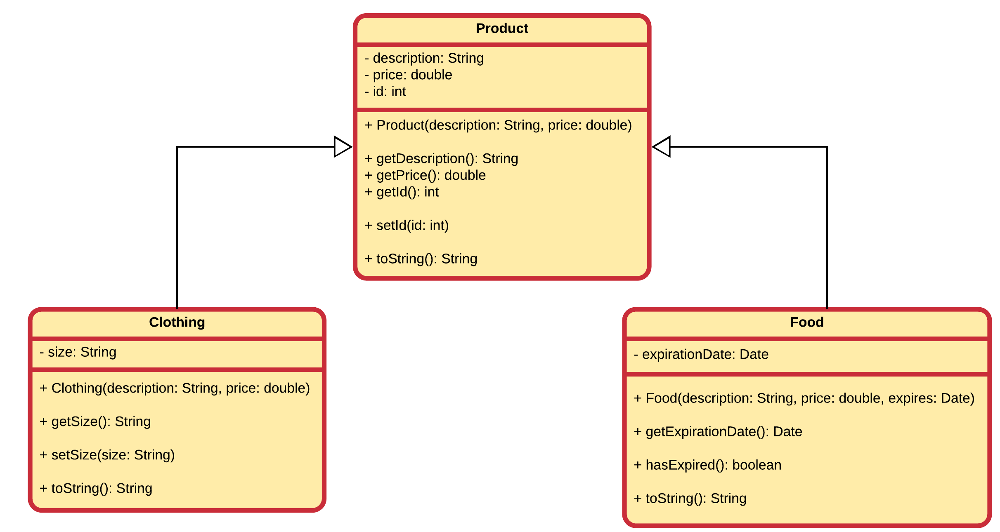
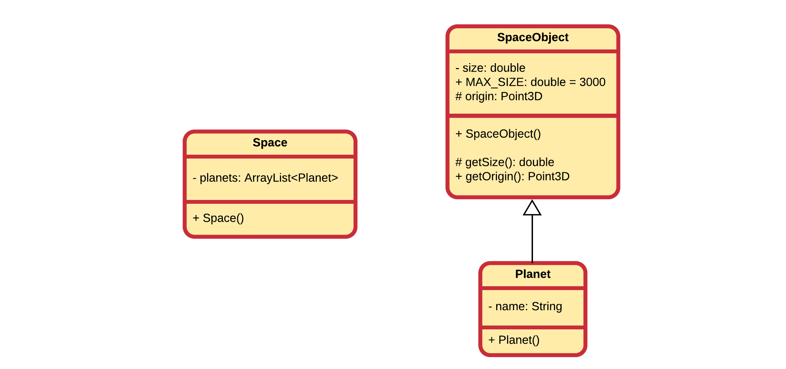

### Accessibility

Attributes and methods are declared with an **access specifier** such as `private`, `protected` or `public`. These allow the developer to determine who can access the class, attributes or methods.

When inheriting from a base class it is important to understand that you cannot access the private attributes or methods of the base class inside your subclass.

Let's take a look at our webshop example.

In the Product class we declared `id`, `description` and `price` to be private (as it should), but that also means that the `Clothing` and `Food` classes cannot access these attributes, even while they did inherit them. However this is not a problem as we did provide getter methods which are public. This means that `Clothing` and `Food` can get the values of these attributes, but they cannot change them.

Now what if we wanted to keep the protection of `private` but allow our subclasses access to some attributes of methods. In this case we can make use of the `protected` keywords. We could for example state that `id` cannot be changed after construction, but `price` and `description` can. In this case we could make `price` and `description` protected.

Let's take another example: consider a class `SpaceObject` with a subclass `Planet`. Than we also create a class `Space` which is composed of several `Planet`s. As shown below, protected attributes and methods are noted using the `#` symbol in UML.

In the example the `size` of a SpaceObject can only be accessed by `SpaceObject` itself, not even by the subclass `Planet`. However `origin` is accessible by both `SpaceObject` and all of its subclasses (such as `Planet`). However not accessible from outside. `MAX_SIZE` is a `final` and `static` class variable which is made `public` and so accessible by all. However as it is `final` it can only be read and not written.

Let's make an overview

| Attribute of SpaceObject | Accessible by Planet? | Accessible by Space? |
|----|----|----|
|size|NO|NO|
|origin|YES|NO|
|MAX_SIZE|YES|YES|

The same rules apply for access specifiers of methods.
