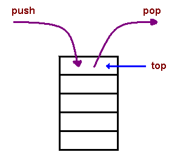

## Composition over Inheritance

When implementing inheritance you should always make sure that it makes sense to inherit. Let's take a look at a bad example of inheritance. Take for a example a class `Vector`. You can find what a `Vector` is @ oracle [https://docs.oracle.com/javase/8/docs/api/java/util/Vector.html](https://docs.oracle.com/javase/8/docs/api/java/util/Vector.html).

> The Vector class implements a growable array of objects. Like an array, it contains components that can be accessed using an integer index. However, the size of a Vector can grow or shrink as needed to accommodate adding and removing items after the Vector has been created.

It has for example the methods `add(int index, E element)` to insert an element at a given index and `elementAt(int index)` to retrieve an element at a given index.

Now if we take a look at the class `Stack` found @ oracle [https://docs.oracle.com/javase/8/docs/api/java/util/Stack.html](https://docs.oracle.com/javase/8/docs/api/java/util/Stack.html)

> The Stack class represents a last-in-first-out (LIFO) stack of objects. It extends class Vector with five operations that allow a vector to be treated as a stack. The usual push and pop operations are provided, as well as a method to peek at the top item on the stack, a method to test for whether the stack is empty, and a method to search the stack for an item and discover how far it is from the top.



The fundamental flaw here is that the `Stack` class also inherits the *public interface* of the `Vector` class meaning you can write the following in Java:

```java
Stack messages = new Stack();

messages.push("Hello");
messages.push("World");
messages.add(1, "Should be at the top");
```

Making your stack look like this:

```text
Hello
Should be at the top
World
```

The `add(int index, E element)` should not be part of the `Stack` public interface, meaning `Stack` should not have been inherited from `Vector`. Stack should only have the `push()` and `pop()` methods.

Than how would you solve this problem ? Simple, using **composition**. We create a class `Stack` and give it an attribute if type `Vector`. This way we have the same functionality but we can hide the public interface of the *Vector* class (remember data hiding from the introduction chapter).

Let's take a look at a really basic implementation of our `Stack` class using composition instead of inheritance

```java
public class Stack {
    private Vector vector;

    // Default constructor
    public Stack() {
        vector = new Vector();
    }

    public void push(int value) {
        vector.add(value);
    }

    public int pop() {
        // This is actually not a good solution to check.
        // Good solution would be to throw exception but that is a subject for
        // later
        if (vector.size() > 0) {
            return (int)(vector.remove(vector.size()-1));
        } else {
            return 0;
        }
    }

    @Override
    public String toString() {
        String output = "";
        for(int i = 0; i < vector.size(); i++) {
            output += "[" + i + "]: " + (int)(vector.elementAt(i)) + "\n";
        }

        return output;
    }
}
```

Now the public interface of our *Stack* class consists of a constructor, the `push()` and `pop()` methods and a `toString()` method.
