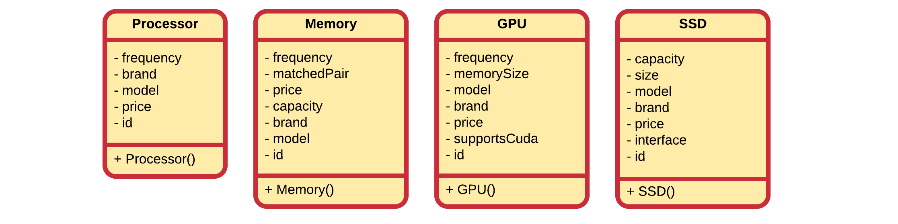

## Computer Store Example

Let us revise the following application that is being build for an online computer web shop. A beginning developer has modeled some of the items that his client wants to sell online. However he has come to the conclusion that his design needs to be refactored.

While they are not documented in the UML, all attributes have getters and setters.

In a first iteration the most common attributes are extracted to a superclass. A good name might be `Product`. Since it is a store that sells products, it seems a logical choice. When selecting attributes from the subclasses to be placed inside `Product`, we must ask our self the question if that attribute is a logical property of computer store product. If not, then something is wrong or our models are wrong.

### Code always changes

Something to remember is that code evolves. It changes over time as things get added, removed or refactored. Static code will eventually become outdated and die.

So let us take the computer store example. Our developer needs help again as his client asked him to also add games to the list of products to sell. The overeager developer created a new class `Game` that inherits from the `Product` class. At first sight nothing seems wrong with it.

First of all it needs to be noted that adding a new product class was really easy as a lot of the functionality and properties are inherited from the `Product` class.

Now taking a closer look at the classes, something can be noticed. Does a game have a model or a brand? In real life: no. Than why does it have a model and brand in the application?

Actually the class `Product` is not entirely accurate since games came into play. While each computer hardware product does have a model and brand, software and games do not. Basically we need to add a class `Hardware` which inherits from the `Product` class. Then our hardware products can inherit from `Hardware` and implicitly also from `Product`, while `Game` directly inherits from `Product`.

