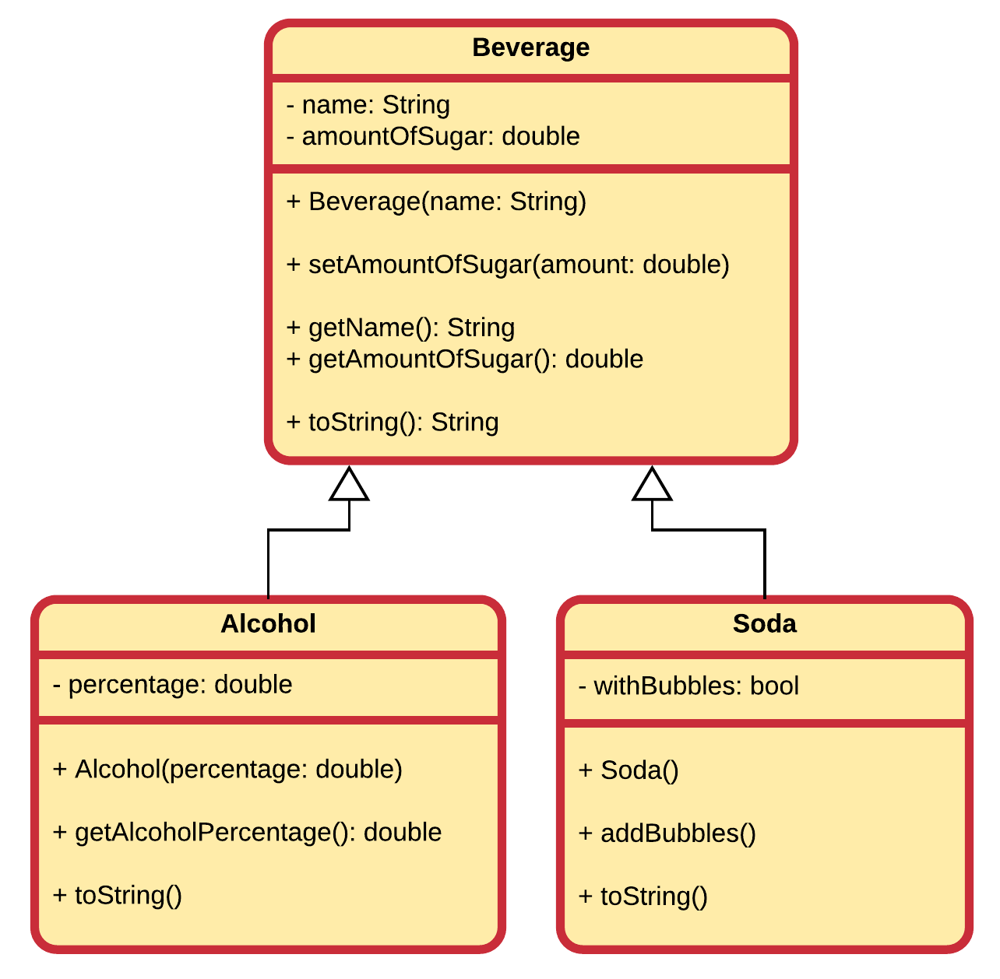
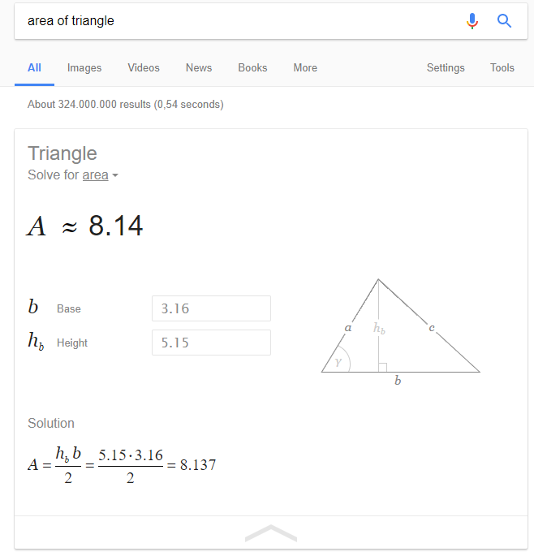

## Exercises

### Computer Store

Take the example of the computer store from this chapter.


Extend the UML class diagram with a class `Software` with the following attributes:
* id
* price
* title
* minimum requirements

### Drinks and Beverages

Below is a UML diagram of model of beverages. It contains a class `Beverage`, which is as a base class for a class `Alcohol` and a class `Soda`.



Implement these classes in Java. Make sure to override all `toString()` methods and personalize it for each class.

## Assignment - Shape Area Calculator

Create a program that can calculate the area of at least 3 different shapes. Let the user choose which shape.

You can use google to check your results.



Also make sure the user cannot enter negative numbers.

Example:

```text
This program calculates the area of different shapes.

For which shape would you like to calculate the area?
1. Triangle
2. Square
3. Rectangle
4. Circle
5. Exit program
Your choice: 1

To calculate the area of a triangle we need the base width and the height of the triangle.
Please enter the width of the base: 3.16
Please enter the height of the triangle: -5.15
Cannot use negative numbers.
Please enter the height of the triangle: 5.15

The total area of a triangle is 8.137
```