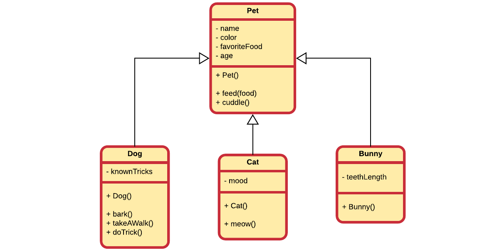

## Is-a Relationships

The superclass and subclass have an **"is-a"** relationship between them. Take the basic example of pets shown below.

Here we can for example state that a `Cat` is-a `Pet`, a `Bunny` is-a `Pet` and a `Dog` is-a `Pet`.

If you cannot logically state that 'subclass' is-a 'superclass' than you made a mistake to make 'subclass' inherit from 'superclass'. An example of this would be the case when you would create a subclass `Mosquito` from `Pet` because `Mosquito` also has color, favorite food and an age. This may seem DRY but it is illogical. You can't state that `Mosquito` is-a `Pet`.

If we needed to model both a `Bus` class and a `Car` class it makes perfect sense to create a `Vehicle` class and make both `Bus` and `Car` inherit from them. It's perfectly valid to state that
* a `Bus` is a `Vehicle`
* a `Car` is a `Vehicle`

A `ChoppingCart` should however not inherit from `Vehicle` because it has wheels.
