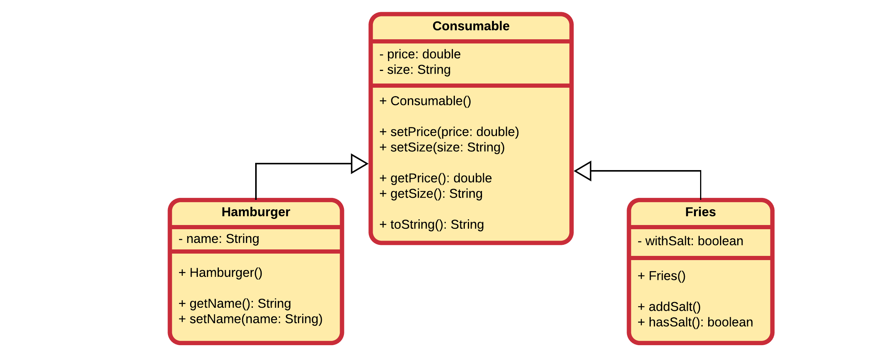

### A McDonalds Application

Let us build an application that can take an order for a McDonalds shop. In a first iteration we start by creating a class `Hamburger` and a class `Fries`.

A hamburger has the following properties:
* price
* name
* size

Fries has similar properties:
* price
* size
* withSalt

We could create both classes in Java without taking the advantages of inheritance into account, but it is pretty obvious that we need some sort of base class with the common properties of these two classes. For example a class `Consumable`.



Before we continue, let's do the `is-a` check:
* `Hamburger` is-a `Consumable`? Ok sounds good
* `Fries` is-a `Consumable`? Ok sounds good too

The `Consumable` class is straightforward:

```java
public class Consumable {
    private double price = 0;
    private String size = "Normal";

    public void setPrice(double price) { this.price = price; }
    public void setSize(String size) { this.size = size; }

    public double getPrice() { return price; }
    public String getSize() { return size; }

    @Override
    public String toString() {
        return "Consumable of " + size + " size [" + price + "eur]";
    }
}
```

Next we add a `Hamburger` class, which extends the `Consumable` class. It also adds some extra data, namely the name of a hamburger (for example: 'BigMac', 'McFish', ...). So to create this class just implement the specifics and than add the `extends Consumable` after the name of the class to make it inherit from the `Consumable` class.

```java
public class Hamburger extends Consumable {
    private String name = "";

    public void setName(String name) { this.name = name; }

    public String getName() { return name; }
}
```

Notice how simple the implementation of our `Hamburger` class is. This is partly because of the inheritance mechanism.

Now the `Fries` class can also be added.

```java
public class Fries extends Consumable {
    private boolean withSalt = false;

    public void addSalt() { withSalt = true; }

    public boolean hasSalt() { return withSalt; }    
}
```
