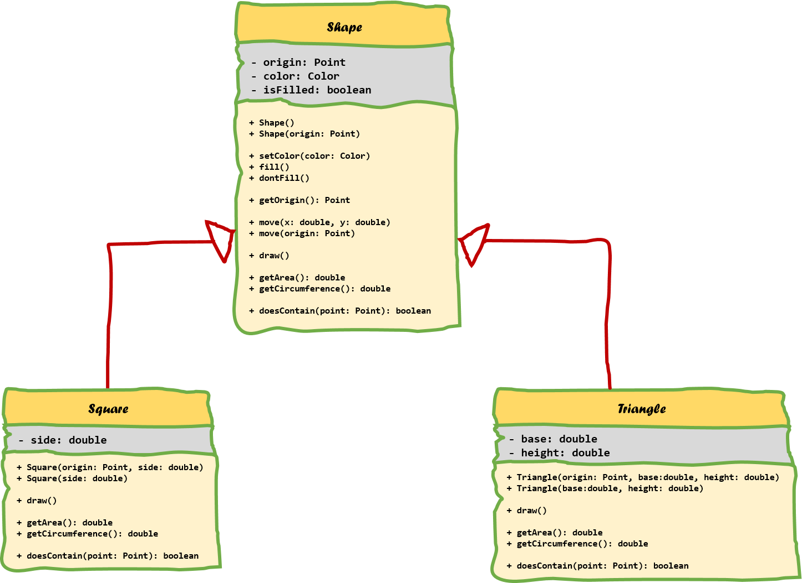

## Method Overriding

Method overriding, in object oriented programming, is a language feature that allows a subclass or child class to provide a specific implementation of a method that is already provided by one of its super classes or parent classes. The implementation in the subclass overrides (replaces) the implementation in the superclass by providing a method that has same name and same parameters (signature), and same return type as the method in the parent class. An overriding method can also return a subtype of the type returned by the overridden method. This subtype is called a covariant return type.

> #### Alert:: Method overriding <=> Method overloading
> Method Overloading is a feature that allows a class to have two or more methods having same name, if their argument lists are different. Constructor overloading allows a class to have more than one constructors having different argument lists. Overloaded methods are differentiated by the number and the type of the arguments passed into the method.
>

The version of a method that is executed will be determined by the object that is used to invoke it. If an object of a parent class is used to invoke the method, then the version in the parent class will be executed, but if an object of the subclass is used to invoke the method, then the version in the child class will be executed.

The ability of a subclass to override a method allows a class to inherit from a superclass whose behavior is "close enough" and then to modify behavior as needed.

The UML diagram below shows a couple of examples of method overriding. First of all there is the `draw()` method that is defined the `Shape` class and its descendants. It takes no arguments and has no return value. Next there are the `getArea()` and `getCircumference()` methods which do return a `double`. Last is the `doesContain()` method which checks if the `Shape` contains a `Point`. It takes an argument and returns a value. Important to note is that the **signature** of all these methods are the same! The rules for method overriding are less strict than that but more on this later.



When overriding a method in Java, you might want to use the `@Override` annotation that instructs the compiler that you intend to override a method in the superclass. If, for some reason, the compiler detects that the method does not exist in one of the super classes, then it will generate an error.

The most basics rules of method overriding are:

* The argument list should be exactly the same as that of the overridden method.
* The return type should be the same or a subtype of the return type declared in the original overridden method in the super class.
* The access level cannot be more restrictive than the overridden method’s access level. For example: if the super class method is declared `public` then the overriding method in the sub class cannot be either `private` or `protected`.
* Instance methods can be overridden only if they are inherited by the subclass.
* A method declared final cannot be overridden.
* A method declared static cannot be overridden but can be re-declared.
* Constructors cannot be overridden.

You can call methods of the base class by using the `super` keyword followed by a `.` and the name of the method you wish to call. This can be useful if you do not want to replace the implementation of the base class but rather want to extend it.

Example:

```java
String result = super.toString();
```
